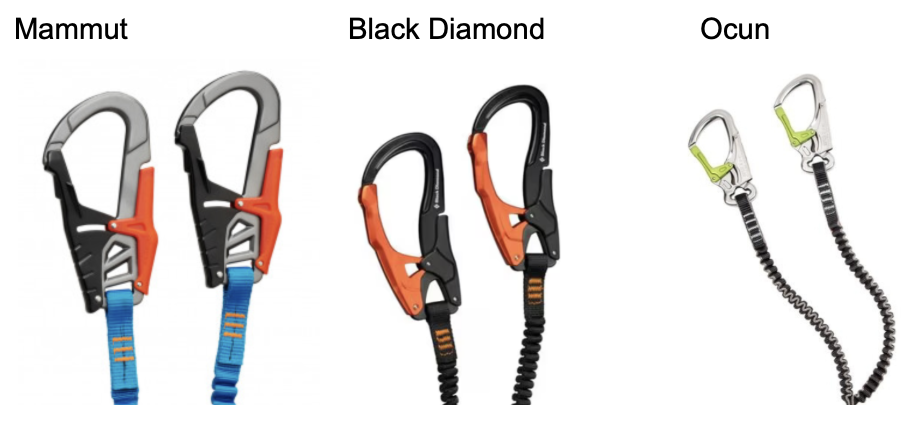
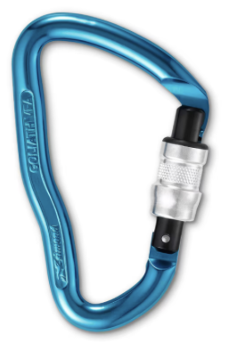
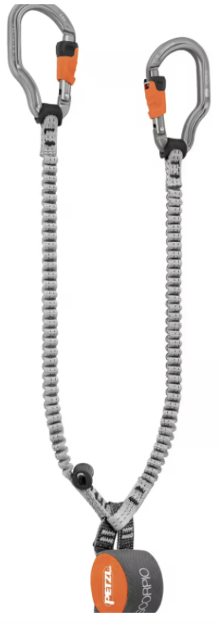

---
title: "Buying your Via Ferrata equipment"
date: 2026-09-14T16:00:00+01:00
summary: "Buying your Via Ferrata equipment"
cover: /img/logo.png
tags:
  - via-ferrata
  - security
  - equipment
  - FAQ
---
You can get your Via Ferrata kit in any shop (in alphabetical order): 

- Aliexpress/Temu: beware of fake products, not recommended, may be good, may be bad but don't take any risks.
- [Bergzeit](https://www.bergzeit.ch/search/?q=via+ferrata&ms=true)
- [BergFreunde](https://www.berg-freunde.ch/klettersets/)
- [Black diamond](https://eu.blackdiamondequipment.com/search?q=via+ferrata)
- [Decathlon](https://www.decathlon.ch/en/sports/climbing/via-ferrata-equipment)
- [Galaxus](https://www.galaxus.ch/de/s3/producttype/klettersteigset-1526)
- [Mammut](https://www.mammut.com/ch/de/search/Via%20Ferrata%20Sets)
- [Oschner](https://www.ochsnersport.ch/de-ch/c/alle-kletterausruestung-771)
- [Intersport](https://achermannsport.ch/?s=via+ferrata&post_type=product&dgwt_wcas=1)
- [Snowleader](https://www.snowleader.ch/de/outdoor/klettern-bergsteigen/klettersteig.html) 
- [Transa](https://www.transa.ch/en/c/equipment/climbing-bouldering/via-ferrata-sets/)

The best time to buy is November to February, all via ferrata in Switzerland are closed, and you can get up to 50 to 70% discount! e.g. 35.- CHF for a PETZL harness, 19.- for a helmet!

The **EN 958 Standard**: All manufactured via ferrata sets sold or used commercially in the EU must comply with strict European safety standards (currently EN 958:2024). This dictates the energy-absorbing capabilities of your shock absorber and the breaking strength of your carabiners

Only EN 958 validated product for via ferrata can be bought, so you buy the brand and design, smaller or bigger carabiners, presence of a resting loop or not, other goodies.

Some prefer big carabiners as they are a bit easier to clip to the safety line. 

PETZL, Mammut, Black Diamonds are top tier brands that constantly push and deliver new innovative products. For example, PETZL offers a rotating via ferrata lanyard that is supposed to avoid tangling.

You can use that equipment for up to 10 years, even if you don't use it after that time only metallic parts like carabiners could be kept.

## Buying used?
Do not buy your equipment on Ricardo, Tutti and co. You need to check the manufacture date (< 10 years) and most of the time, the price is very close to new without any guarantees. 

You do not know how the equipment was abused (fall, drop), or if it was drying up in an attic or worse in a humid cellar (moisture = hydrolysis of polyester, involves breaking its ester bonds by reacting with water, usually catalyzed by acids, alkalis, or enzymes. This reaction reverses the polyester formation, returning the polymer into its original monomer building blocks: a diol and a dicarboxylic acid (or carboxylate salt)).

## Retiring old products
Most manufacturers place a lifespan of 5 to 10 years on via ferrata lanyards and harnesses. Even if stored perfectly, synthetic materials weaken over time.

After a fall, or when it is too old, take a scissor and cut it into parts, this avoids that it is retrieved from the garbage and sold used somewhere. You can most of the time keep metallic carabiners (near infinite lifespan if no wear)

## Storage
Improper storage of via ferrata gear can degrade materials, compromising your safety during a climb. Key risks include damage from moisture, UV radiation, and chemical exposure. Store in a dry, well-ventilated area away from damp basement walls. 

Let gear dry naturally before packing it away. Keep equipment in a dark place, such as a gear closet, drawer, or storage bag, out of direct sunlight. Keep in a cool environment with stable temperatures. Avoid storing gear in hot attics or car trunks.

## Buying a resting lanyard
Fix or adjustable for more convenience and confort, Budget around 40.- (without a carabiner)

You can also use them with a PETZL Reverso to rappel down, on Zip line.

## Buying via ferrata lanyard
Choose carefully your set and prefer one that has:

Elasticated Webbing: Stretches out when pulled and retracts close to the body, preventing the arms from snagging on rocks or the cable.

Palm-squeeze / Ergonomic Levers: Unlocks when you squeeze the back of the gate with your palm, great for frequent one-handed clipping.

A NOT too big Wear-out Webbing: Via ferrata lanyard uses folded and stitched webbing inside a zipper pouch that rips open progressively during a fall to cushion impact. An example of a brand with a huge wear-out bag is Rocket Empire but there are others. They are bulky and heavy and difficult to remove from your harness.

Rest Loop: A short loop attached directly next to the absorber block to clip a dedicated resting carabiner so you can hang and rest safely without misusing the main lanyard arms. While nice you can only rest with it if the hook is really close to your belly.

### Nice to have

Integrated Swivel (Spinner): A small axis joint near the harness that stops the elastic arms from twisting together as you turn and clip. It does not always work, add some weight too.
Choosing the right carabiners: prefer palm-squeeze / ergonomic Levers

It is mainly a matter of taste and how fast you wanna clip to the safety line.

Any carabiners, ideally big for easier clipping, with a button on the other side work great.

Most rentals equipment or cheap via ferrata sets offer basic carabiners, don’t buy a kit like this as you have to twist and put one finger against the rock to open it (rubbing your finger for hours can be painful)

These use a Slide-ring Automatic Locks: Unlocks by pushing a small sliding collar down with your fingers.

Even PETZL has one of these in his offering ☹️

## Zip line pulley
You don't need them in Switzerland, but in France and other places you need to bring your own pulley. The standard is PETZL. Attention there are 2 kinds of pulleys!

- The silver pulley is for steel cable
- The Red pulley is for cable

Verify before doing any via ferrata with ZipLine that the pulley is fixed in place

## Shoes
For via ferrata, you want a moderately stiff, semi-rigid sole rather than a fully flexible trainer or a completely rigid mountaineering boot. A semi-stiff sole supports your weight on narrow iron rungs and tiny rock edges without foot fatigue, while retaining enough flexibility for the hiking approach.

### Why Stiffness Matters

- Support on metal rungs: Soft shoes cause your foot to bend over narrow iron bars, straining your arches and hurting your feet after a few hours. 
- Edge precision: A stiffer forefoot allows you to stand securely on small rock ledges or steel steps using just the tip of your toe.
- The "Climbing Zone": Look for a smooth, sticky rubber patch under the toes (common in approach shoes) for maximum friction on bare rock.

Choosing the Right Level of Rigidity
- Too soft (regular sneakers or standard trail runners): Your feet will cramp and tire quickly on metal rungs, and the rubber lacks edge grip. 
- Just right (technical approach shoes or light alpine mid-boots): Offers torsional rigidity (resisting twist), a sticky rubber outsole, and a supportive midsole.
- Too stiff (heavy, full-shank mountaineering boots): Uncomfortable and clumsy for regular walking unless you are crossing steep snowfields or glaciers.
