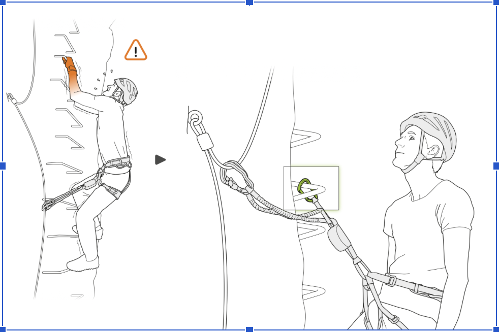
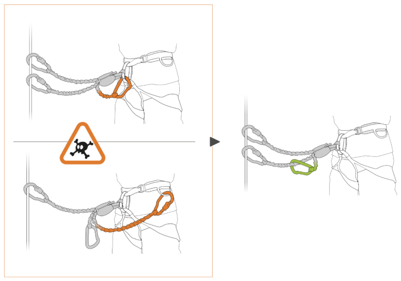
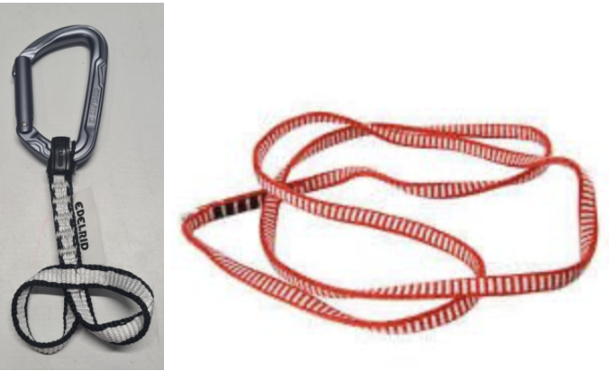
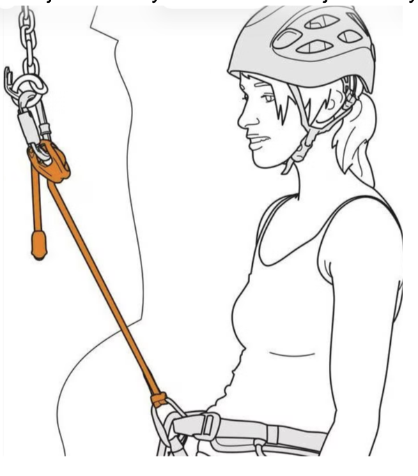

## A resting lanyard is nice to have:
- Let you rest your arms 
- On long or difficult passages of via ferrata, 
- During traffic jams on the way up 
- Simply take a picture, rest, eat, drink.

It is also an additional safety on bridges and horizontal sections with overhang below where a fall would be catastrophic (if you're climbing alone)


Never ever climb with the resting lanyard connected to the safety line or any fixed anchors, this would shortcut the energy absorber in a fall.

In all cases, you MUST REMOVE the resting lanyard if you continue climbing as it AVOID the energy absorber to expand in a fall!!!

Never connect an arm of the lanyard to the harness (prevents energy absorber deployment) or the resting lanyard to the belay loop!

ALWAYS connect your resting lanyard ABOVE your harness.

NEVER ever continue climbing while being connected with your resting lanyard and a fixed point.

REMOVE the resting lanyard when you continue climbing.



## Rest before you are exhausted to avoid a fall

## Differents types
- Via ferrata lanyard for resting
- Integrated via ferrata lanyard loop for resting
- A Sling with a carabiner
- Adjustable lanyard for resting

### Via ferrata lanyard for resting

#### Cons
- It puts some additional (low) stress on the energy absorber.
- - Because of the elastic lanyards, it will stretch and lower your position.
It may not put you in a comfortable resting position. A too low seating position for example.

#### Pros
- You carry no additional weight.
- Cheapest solution, no additional costs.

#### Proper usage
- You move ONE carabiner from the safety line to a fix point: stairs, ladders, rings, anchor. 
OR
- If there is no fix point in your current section: You clip one carabiner into the next section. Your ferrata set is then connected to the section above and the previous section. You can rest in this position. It may not be comfortable though. You can realistically only rest at the start of a new section.

### Integrated loop for resting
Some via ferrata lanyard sets have an integrated loop to add an additional carabiner (in Green). It is clearly written on it, just after the energy absorber you may find a loop or ring.

#### Cons
- It puts some additional (low) stress on the energy absorber.
- It may not put you in a comfortable resting position. A too low seating position for example.
- You can only clip yourself to something (a stair, a ladder, a ring, …) which is not too far away (close) from your belly or harness loop.

#### Pros
- It is the cheapest solution, cost one more carabiner < 20.- CHF
- Additional weight is limited.
- It works great on ladders and steps, not so well on distant rings/anchors .

##### Proper usage
- Just clip to any fix point at your belly height: ladders, steps, rings.

### A Sling with a carabiner
A Sling with a carabiner connected to the belay loop

#### Cons
- It may not put you in a comfortable resting position.
- You can only clip yourself to something (a stair, a ladder, a ring, …) which is not too far away (close) from you.
- Distance can not be adjusted easily without knots or doubling the sling.
- See Dyneema sling (optional) limitations chapter. In short, never climb while connected, static, break in fall factor 1 or 2.

#### Pros
- Cheap (12.- CHF) + one Carabiner (< 20.- CHF)
- Additional weight is limited.
- You can clip yourself  to something at bigger distances from you but distance can not be easily adjusted.

#### Proper usage
- Just clip to any fix point at your belly height: ladders, steps, rings.
- While not in use the carabiner is connected to the gear tool loop.

### Adjustable lanyard for resting

An adjustable lanyard like PETZL adjust or any other brand.

#### Cons
- 45.- CHF + one Carabiner < 20.- CHF.
- Small but additional weight.

#### Pros
- Most flexible, you can clip to distant anchors and adjust length.
- Comfortable.
- A short dynamic rope, but not long enough to absorb fall, consider it static too.

https://www.galaxus.ch/de/s3/product/petzl-connect-adjust-zubehoer-klettern-42385620

#### Proper usage
- You can clip to stairs, ladders, rings, anchors. Any fixed point that you can reach but you always stay connected to the safety line with your via ferrata kit.
- If there are no stairs, ladders, rings, anchors, You can clip the resting to the safety line ONLY at the start of a new section, just above the bold/anchor. 
- Don't climb, just relax/pictures,drinking/eating/waiting and remove it when you can continue. 

## Resting lanyard usage on bridges 
Falling on a bridge “could” trigger the via ferrata energy absorber opening, you would be hanging 2 to 3m away from the safety line, it is difficult if not impossible to recover without proper rescue training. You can use the resting lanyard to stay closer at all times from the safety line before and after a fall. 

It forces you to manage one more carabiner (the resting carabiner and the two carabiners of the via ferrata lanyard) and may slow you down a bit.

