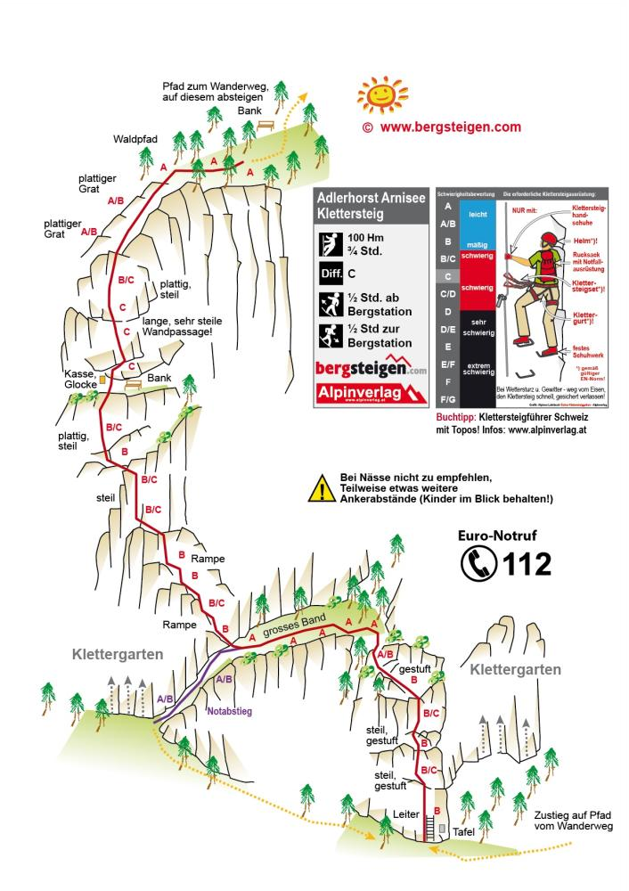




Not executed yet 🥲


The Klettersteig Adlerhorst at Piel Flue above Arnisee in Uri, Switzerland, is a scenic, family-friendly via ferrata rated up to C/D (K4) featuring a length of 230 meters and gorgeous views of the Urner Reusstal.
Key Fact Sheet
• Difficulty: C/D (or K2–K4 on the Hüsler scale; features a steep C-wall and a small overhang key section, plus an emergency exit)
• Elevation / Length: 100–140m vertical climb (187–205m total height), 230m cable length
• Times: ~20–30 min approach from Arnisee, 45–60 min climbing time, 30–40 min descent
• Season: Typically open from early May to late November (weather permitting)
• Access: Take the Intschi-Arnisee cable car up, then follow signs toward "Sunnig-Grat" before branching off toward Piel Flue

## Topography 🗺️

