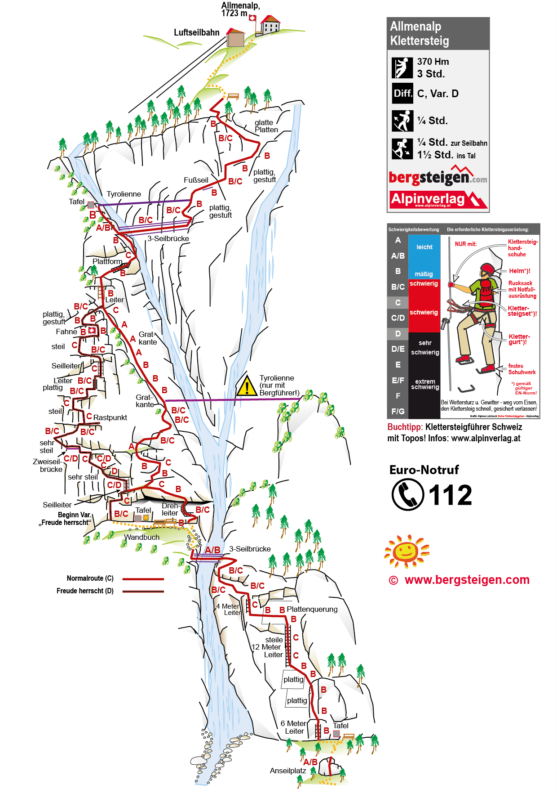





## Location


 👨‍⚖️
Newcomers [MUST sign the waiver form](https://forms.gle/phYLQZ5mvnNeuR9N9), it contains detailed information about the risks difficulty and more 


 📓 
The [Ferrata Together QuickStart Guide](https://docs.google.com/document/d/19oks3FaopmkEDDOAUF163Lo_qWMmBgFS0Ht5TqTf0YA) is a good start to learn how to execute via ferrata in safety, a must read for beginners and experienced climbers. It contains a lot of tips.


## Route overview ℹ️
For beginners that do NOT fear heights.
The vertical face directly after the starting point, the four roaring waterfalls of the Allmibach, the two three-rope-bridges or the zip line – the via ferrata Allmenalp won't leave one wish unfulfilled!

* Difficulty: K4
* Variation in height: 550 m
* Height difference: 370 m
* Iron steps: 880x
* Ladders: 4x
* Bridges: 2x
* Zip lines: 2x (1x 50m) / (1x 110m only accessible with a guide)

Variant «Freude herrscht» for more advanced climbers but shorter
The variant "Freude herrscht" is classified as K4+ in the SAC via ferrata scale. This means that this variant is very difficult to climb and is therefore only suitable for experienced climbers free from giddiness.

* Difficulty: K4+
* Variation in height: 240 m
* Height difference: 150 m
* Iron steps: 394x
* Ladders: 3x
* Bridges: 1x


* Both have NO exit points, if you climb, you have to finish it, climbing way down is not an option.
* Both require fitness endurance of 2 hours, but I have done it alone in 1.2 hours with short breaks.
* Gloves are MANDATORY, the surface is mostly flat and you need to grab the safety line most of the time. You can buy gloves for 7.- at the cable car station


## Season 🗓️
Typically 16 May/June through late October (conditions permitting)


## Weather ☀️
Weather can cancel/abort/shorten the event a few days before if weather is not perfect for execution!  


Source:
- [MeteoSwiss](https://www.meteoschweiz.admin.ch/lokalprognose/kandersteg/3718.html#forecast-tab=detail-view)

## Meeting point 📍



Recommended is to take an earlier train through, so you have more reserve time for the last K5 (optional) and enough time to reach the chairlift.

## Recommended train 🚂



## By Car 🚗



## Cable Car 🚠

You only need to take the Luftseilbahn Kandersteg-Allmenalp cable car after the via ferrata to avoid 2h more trekking down the mountain. 


- Because it travels a relatively short horizontal distance while climbing a massive, near-vertical rock face, it is widely considered one of the steepest cable car rides in Europe. The 554-meter altitude gain takes just under 5 minutes to complete 
- After the climb, we can use the cable car to avoid a trek down (+2h, steep) back to the valley. 
- Tickets can be purchased directly at the valley station. They accept cash (swiss francs), Twint and most of the major debit- and creditcards.


## GPX 🗺️


## Approach hike 🥾




From the bottom cable car station, you cross a small bridge over the Allmibach river and hike uphill through the forest for about 20 minutes to reach the base of the rock wall


## Exit trek 🚶🏻‍♂️



From the bottom cable car station, you cross a small bridge over the Allmibach river and hike uphill through the forest for about 20 minutes to reach the base of the rock wall


### Using cable car
15min walk steep to restaurant, toilets and cable car.
Take the cable car back down to the valley, then walk to the train station. 

### Hiking back
Alternatively, you can hike back down via the trail passing through Ryharts and Schneitböde (1¼ hours).

https://s.geo.admin.ch/gop8redxu68c

## Travelling home 🏡

by public transportation

## Ferrata Together WhatsApp groups 💬



## Water 🚰 

The route is exposed to the sun from 9:00 in summer, throughout the season. 
In the afternoon, the wall is in the shadows, even if air is 17°C, wihtout wind it get really hot (feel like 25°C)
No access to water for 2 hours!

## Lake 🏊
if you finish early, possibility to go to OeschninenSee in the afternoon  (+22.50.- CHF cable car) but over crowded lake

## Renting equipment 🛍️
Please send an email now or call and reserve a via ferrata set with helmet for this satursday:
There's a rental service directly with the valley station (Luftseilbahn Kandersteg-Allmenalp Allmenbahnstrasse 23 CH-3718 Kandersteg) of the cable car, opening hours 08.30 – 17.00 h. https://www.allmenalp.ch/en/experience/climbing.html
Renting Equipment (+25 CHF max)
* Whole equipment (helmet, via ferrata-set, harness but no gloves: CHF 25
* only helmet: CHF 7
* only via ferrata-set: CHF 10
* only harness: CHF 10
* material to buy: gloves CHF 5 

## Other things to do
* Take gondola to Oeschinensee Lake: hike lakeside or rent a boat 
* [Go paragliding](https://paragliding-kandertal.ch/angebote/erlebnisflug-allmenalp/) 
* [Hiking map](https://www.allmenalp.ch/de/erleben/wandern.html)
* Naturpark Blausee 
* Rodelbahn Oeschinensee 

## Links 🔗
- [Allmenalp via ferrata official page](https://www.allmenalp.ch/en/experience/climbing.html)
- [SAC](https://www.sac-cas.ch/de/huetten-und-touren/sac-tourenportal/allmenalp-8207/klettersteig/klettersteig-kandersteg-allmenalp-1840/)
- [VIVA Ferrata](https://vivaferrata.ch/en/route/kandersteg/via-ferrata-kandersteg-allmenalp?map=7.65326%2C46.49072%2C14)

## My review ⭐️
Beginner friendly if no fear of heights

- Scenic, cascade, view
- Vertical 400m
- Easy access 15min from parking and rental
- Easy exit 15min to restaurant
- The cable car is currently broken! Add 2h of demanding trek down
- Lots of irons steps 900x, easy climb
- Left path K4 “Freude Herscht” more vertical, difficult and … a bit boring but it has the Swiss flag for nice pictures
- Right path K3 more diverse (ridge, shadow, cascade)
- No shadow after 9:00 can be hot even with 17°C air
- Can be overcrowded during weekends, a 1h20 “Freude Herscht” for experienced climbers can be 3 or 4h or worse, so start early before 9:00

## Topography 🗺️ 

## Gallery 🌄 


## 📆 Ferrata Together log
Ferrata Together visits:
| Date | Number of people |
|----------|--------------------|
| 14 August 2026 | 4 |
| 7 June 2026 | 3 |
| 23 Mai 2026 | 19 |
| 2025 | 9 |
| 2025 | 12 |