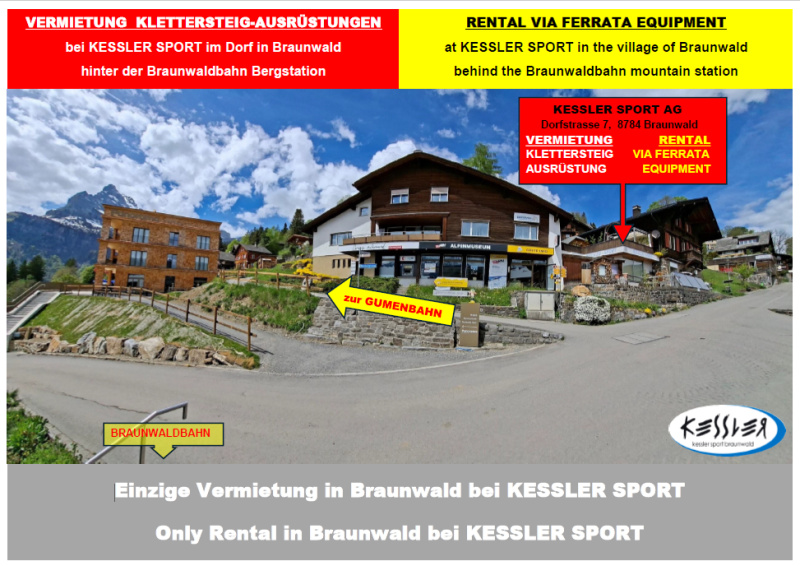





## Location


 👨‍⚖️
Newcomers [MUST sign the waiver form](https://forms.gle/phYLQZ5mvnNeuR9N9), it contains detailed information about the risks difficulty and more


 📓 
The [Ferrata Together QuickStart Guide](https://docs.google.com/document/d/19oks3FaopmkEDDOAUF163Lo_qWMmBgFS0Ht5TqTf0YA) is a good start to learn how to execute via ferrata in safety, a must read for beginners and experienced climbers. It contains a lot of tips.


## Braunwald via ferrata flyover


## Route overview ℹ️

The via ferratas are located on the Eggstöcke, above the Gumen, which you can reach comfortably with the Gumen combined cable car.

This via ferrata can be really busy and lead to more waiting time, approximately 8000/10000 visitors estimated per year.

You must start early enough to not miss the last chairlift at 17:00 to 17:30

The time you spend climbing depends entirely on which of the three interconnected circuits you choose:

### Circuit Leiteregg - K3 - 2,310m 🏔️

First Stage (blue) with safety rope - K3 -  Total time 2.5 to 3.5h. Catch an early morning train, tackle the Short (Leiteregg) circuit, and you can easily be back in Zurich by mid-afternoon.

Great entry point for beginners with a head for heights. Features steep ladders and exposed chimneys with solid iron stirrups. Includes the spectacular 16-metre Charlotte Bridge suspension bridge. 

### Leiteregg ascent - K5 - 2,449m 🏔️

Alternative first Stage (double track) as a relief route to the previous K3 route (difficulty approx. K5), go to the left to find the start.
A new, highly challenging K5 / Grade D/E variation exists at Leiteregg for experts. Well secured with enough irons and steps, has small overhang that can be easily overcome with good cliping and feets techniques.

### Tour Vorder - K3 - 2,420m 🏔️

Second Stage Mittler Eggstock (red) - K3 - Total time 2.5 to 5.5h

A scenic, airy ridge traverse. Requires solid stamina but maintains very secure footing with consistent cable lines. Ends at the Mittler Eggstock plateau near a small emergency bivouac box. You can exit down to Gumen from here if you want to skip the final wall.

### Tour Vorder - K5 - 2,455m 🏔️

Final Summit Hinter Eggstock (black) with safety rope K5 -  Total time 5.5 to 6.5h

Strictly for experts. A short but extremely physical 80-metre vertical ascent. Demands significant upper-body strength, absolute composure, and rock experience. Features a steep, slightly overhanging crux that must be navigated with careful technique.

### Tschingel exit - K3 - 1h 🏔️

If you do not finish with the last K5 part, the climb down will take more or less one hour, it is easier to climb backward and just look where to put your feets.

The descent may be crowded, and you may lost some time waiting, especially when close to the last double ladder.

 
We saw a huge rock falling last time on the right side of the Tschingel, it's size was bigger than a person head, this zone may be secured but don't stay too long in this part of the climb, and also while trekking back on the path. Keep your helmet till the chairlift!


After the end of the via ferrata, if you run fast, you can reach the chairlift and Berggasthaus Gumen in 15min, a more real number is more 25-30min walk.

## Weather ☀️

Weather can cancel/abort/shorten the event a few days before if weather is not perfect for execution!  



Source:
[2700m Braunwald](https://www.meteoschweiz.admin.ch/lokalprognose/braunwald/8784.html#forecast-tab=detail-view)

## Season 🗓️

Typically June through late October (conditions permitting)



## Meeting point 📍



Recommended is to take an earlier train through, so you have more reserve time for the last K5 (optional) and enough time to reach the chairlift.

## Recommended train 🚂



To reach the Braunwald via ferrata by train, take the Swiss Federal Railways (SBB) network directly to the [Linthal Braunwaldbahn station](https://maps.app.goo.gl/piD9NXXSC639UZGk7), which sits right next to the funicular valley station.

Exit the train at Linthal Braunwaldbahn (do not miss it and stay on until the final Linthal terminal station). The train platform is connected directly to the funicular base station via a short, covered walkway.

## Cable cars 🚠

### Braunwaldbahn funicular

You'll have first to take the funicular that is located in the SBB train station. Board the Braunwaldbahn funicular (Braunwaldbahn, Stachelbergweg 2, 8783 Linthal) for a 7-minute ride up to Braunwald village.

- With a GA it is free to go to braunwald, but you'll have to pay for the chairlift anyway a day ticket 30.-
- With Half fare, you'll a discount and pay for the day ticket 35.-
- [Get a day pass](https://sportbahnen-braunwald.ch/de/informationen/sommer/betriebszeiten-sommer.html) for +35.- CHF
- A GA Duo has proven twice to not work through the first checkpoint, ask for help and you will get through for free (add some delays to get to the desk if the queue is important)

### Gumen combined cable car

[Walk through for 16min/900m](https://maps.app.goo.gl/BvKUCgqszxhVuHog9) the car-free village and take the Gumen combination chairlift up to the Berggasthaus Gumen (1,901 m), which serves as the start of the trail to the via ferrata.

The GA won't let you go up for free with the chairlift to Gumen, you'll have to pay a day ticket anyway (30.-)

The [Kombibahn Gumen](https://sportbahnen-braunwald.ch/de/informationen/sommer/betriebszeiten-sommer.html) (Gumen combined chairlift and gondola lift) in Braunwald operates daily during the summer season (June 6 to October 18, 2026) from 08:45 to 12:30 and 13:30 to 16:30, with continuous operation until 17:00 during peak periods and high guest volume.

#### Operating Hours & Schedule Details

- **Standard Hours:** 08:45 AM – 12:30 PM and 1:30 PM – 4:30 PM daily.
- **Lunch Break:** Operations pause between 12:30 PM and 1:30 PM, though the break is skipped if visitor volume is high.
- **Extended Hours (October 1–18, 2026):** Open continuously from 08:30 AM to 5:00 PM (running on a 30-minute rhythm, weather permitting).
- **Weather Clause:** High winds, heavy rain, or very low guest numbers can cause temporary suspension or closure.

## By Car 🚗

To reach the Braunwald via ferrata (Eggstöcke Klettersteig) by car, drive to the [**Linthal Braunwaldbahn station**](#gumen-combined-cable-car), park your vehicle, take the [**Braunwaldbahn funicular**](#braunwaldbahn-funicular) up to the car-free village of Braunwald, and proceed via the Gumen combined cable car to the Gumen starting point.

## Parking 🅿️

Use the large open-air and covered parking facilities directly at the Linthal valley station. The parking use [ParkingPay](https://parkingpay.ch) and not EasyPark. You can pay with twint.

## Approach hike 🥾

From Berggasthaus Gumen (1901m) follow the marked alpine path diagonally up past the paraglider launch area on the Gumengrat ridge to the via ferrata entry point.



## Exit hike 🚶🏻‍♂️


see [**Tschingel exit - K3 - 1h**](#tschingel-exit-K3-1h)

## Travelling home 🏠

If you take on the Medium or Long circuits, expect to spend the entire day out, returning to Zurich in the evening

## WhatsApp group 💬



## Water 🚰
No access for the duration of the via ferrata.

Get water or drinks at
- Braunwald Bahn station (public WC)
- Restaurants on the way
- Berggasthaus Gumen (1901m)

## WC 🚾 🚽
- Braunwald Bahn station (public WC)
- Restaurants on the way
- Berggasthaus Gumen (1901m)

## Renting equipment 🛍️

Please [send an email](https://www.braunwald.ch/klettersteige) now or call and reserve a via ferrata set with helmet

or use 
From 06. JUNI 2026 to 18. OKTOBER 2027 (Operating time of Kombibahn Gumen)

[Kessler Sport AG](https://www.kesslersport.ch/cms-klettersteige.asp)

## Donation 💶
Maintaining the Via Ferrata Braunwald cost from 10k to 20k per year because of rocks falling, winter, thunder, ...



## Defects ⛓️‍💥

Noticing some defects during the climb? contact immediately:




## Links 🔗

- [off-the-trail.de](https://www.off-the-trail.de/jegihorn) 
- [Outdooractive](https://www.outdooractive.com/en/route/via-ferrata/glarus/the-braunwald-via-ferrata-over-the-eggstoecke-in-the-glarus-alps/1374268/)
- [glarnerland.ch](https://glarnerland.ch/en/map/detail-poi/braunwald-via-ferratas--id--tou_s9t_fgcffgvj-igih-eggt-qbau-gsatidcaqcgc.html)
- [braunwald.ch](https://braunwald.ch/de/sommer/klettersteige.html) 
- [adrenalin.gl](https://adrenalin.gl/en/via-ferrata-braunwald)

## My review ⭐️
- Overall an easy via ferrata for experienced climbers
- The huge number of climbers on the wall can increase the time and difficulty: using a resting lanyard can help reduce the fatigue.
- The K5 at the beginning is easy too, but do not forgive any cliping mistakes or bad techniques.
- Start early enough if you wanna do the last K5
- Do not under estimate the time to climb down the K3

## Topography 🗺️

## Gallery 🌄



## Video 🎥

## GPX 🗺️
 


## MAP 🗺️



## 📆 Ferrata Together log

Ferrata Together visits:
| Date | Number of people | Organizer |
|----------|--------------------| ---- 
| 20 Sept 2026 | 9 | Cédric Walter |