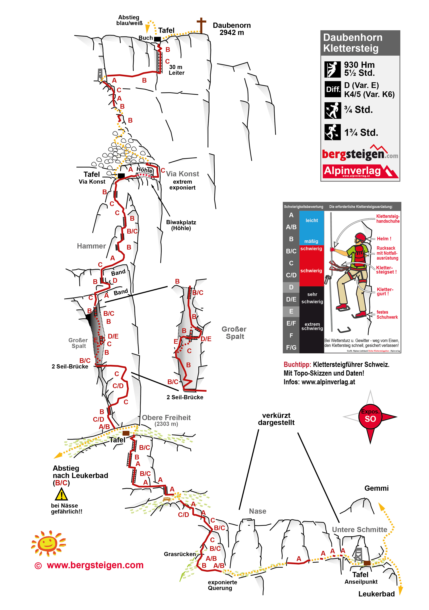





## Location


## Daubenhorn via ferrata flyover


## Route overview ℹ️
The Daubenhorn via ferrata is the longest in Switzerland. With the difficulty level ED (extremely difficult), the adventure is aimed at experienced and fit mountaineers. The via ferrata ascends almost vertically along the rock towering above Leukerbad:
- Over 2,000 meters of steel cable, 
- 216 meters of ladders,
- 920 to 1,000 meters of vertical elevation gain.


- Route wise there are sections with no hand or foot metal, just the cable and the rock, so bring gloves. The climbing is strenuous in places,
- There’s a few spots with some pretty wild exposure, traversing around a corner with some 2000m drop behind you 
- For someone in good physical shape it is between moderate and hard, with the most difficult section being inside the cave


 👨‍⚖️
Newcomers [MUST sign the waiver form](https://forms.gle/phYLQZ5mvnNeuR9N9), it contains detailed information about the risks difficulty and more


 📓 
The [Ferrata Together QuickStart Guide](https://docs.google.com/document/d/19oks3FaopmkEDDOAUF163Lo_qWMmBgFS0Ht5TqTf0YA) is a good start to learn how to execute via ferrata in safety, a must read for beginners and experienced climbers. It contains a lot of tips.

   
## Duration ⏱️

About 8-10 hours total (including access and descent).

## Season 🗓️

Typically Juli to October (conditions permitting)



## Weather ☀️

Weather can cancel/abort/shorten the event a few days before if weather is not perfect for execution!  

Source:
- [MeteoSwiss](https://www.meteoschweiz.admin.ch/lokalprognose/leukerbad/3954.html#forecast-tab=detail-view)

## Start early
It is better to sleep a day before in this hotel and start even earlier than the first cable car, around 5, 6 ot 7:00AM

 📓 
Reserve a room, so you can start earlier the climb
https://www.gemmi.ch/en/


## WhatsApp group 💬 



## Meeting point 📍



Recommended is to take an earlier train through, so you have more reserve time for the last K5 (optional) and enough time to reach the chairlift.

## Recommended train 🚂



9:38 Gemipass
[Link](https://www.sbb.ch/de?stops=Z%C3%BCrich+HB_I8503000%7EGemmipass_I8501657&day=2026-09-26&time=06_00&moment=dep&cursor=M3xPQnxNVMK1MTTCtTQxNTEwMsK1NDE1MDg2wrU0MTUzMjbCtTQxNTMyNsK1MMK1MMK1MzY1wrU0MTUwODDCtTHCtTDCtTE2wrUwwrUwwrUtMjE0NzQ4MzY0OMK1McK1MnxQREjCtTkyYTcxZjcyYjBiNDNkMmU5YmMwMzhiZDkzMzU2YTQwfFJEwrUyNjA5MjAyNnxSVMK1NjAwMDB8VVPCtTB8UlPCtUlOSVQ%3D&trip=-1_2)

### Take the Train to Leuk
The closest main-line train station to the mountain is Leuk.

- From Geneva / Lausanne / Sion: Take the direct InterRegio (IR90) train heading toward Brig and exit at Leuk.
- From Zurich / Bern / Basel: Take the InterCity (IC8 or IC61) south through the Lötschberg Base Tunnel to Visp, then make a quick cross-platform transfer to a regional train back to Leuk.

### Catch Bus 471 to Leukerbad
Directly outside the train station, board the LLB (Leuk Leukerbad Bus) Route 471. The bus departs roughly every 30 minutes, perfectly timed to meet arriving trains. The mountain drive takes approximately 30 minutes to reach the Leukerbad, Busterminal.

### Transfer to the Gemmi Cable Car
Once you arrive at the Leukerbad bus terminal, you have two simple options to reach the cable car:
- **Local Bus:** Switch to the local Ringjet village bus, which drops you off directly at the Leukerbad, Gemmi-Bahnen stop.
- **Walking:** Walk through the alpine village to the station; it is a scenic, slightly uphill walk of about 10–15 minutes.

From there, the Gemmi Cable Car will bring you up the cliff face to the pass to begin your climb up the Daubenhorn

## By Car 🚗

To reach the Daubenhorn (and its famous via ferrata) by car, drive to the mountain village of Leukerbad in the canton of Valais, park at the Gemmi-Bahnen cable car station, and take the cable car up to the Gemmi Pass to start your climb or hike

From the North (Bern / Thun / Zurich / Basel): Take the A6 highway toward Spiez, head toward Kandersteg, and use the Lötschberg car shuttle train (Kandersteg–Goppenstein). From Goppenstein, follow the signs via Gampel and Leuk up to Leukerbad

## Parking 🅿️

Parking in LeukerbadGemmi-Bahnen Parking: Multi-story and open-air parking spaces are available directly at the Gemmi cable car valley station.

Alternative Village Parking: You can also use other central parking garages in Leukerbad, such as the Sportarena or Alpentherme garages, and follow local signs to the cable car.



## Cable Car 🚠

- 
- 

### Gemmi cable car operating times

Current Operating Hours (7 September – 4 October 2026)

Daily (Monday – Sunday): 08:30 – 17:00
Frequency: Departures run every 30 minutes (on the hour and half-hour). 

During peak demand periods, it runs continuously every 10 minutes.

The cable car transitions its opening hours as the seasons shift
- 5 October – 8 November 2026 09:00 – 17:00
- 9 November – 18 December 2026 Closed for autumn maintenance
- 19 December 2026 – 18 April 202709:00 – 17:00 (Winter Season)

## GPX 🗺️


## Start 🏁


## End 🎯
2,941 meters (9,649 feet) above sea level


## View from Daubenhorn





## Exit 🚶🏻‍♂️
The walk off is also not to be underestimated, another good 2.5hrs from the top back to the gondola station. Crosses the small Daubenhorn Glacier down to Lämmerenboden and back toward the Gemmi area.

## Travelling home 🏡
by public transportation

## Water 🚰
No access for the duration of the via ferrata.

Get water or drinks at
- 

## WC 🚾 🚽
- 

## Links 🔗
- https://www.valais.ch/en/explore/activities/other-summer-activities/fixed-rope-routes/small-daubenhorn-via-ferrata-k5-k6

## My review ⭐️

## Topography 🗺️ 



## Gallery 🌄 


## 🎥 Video


