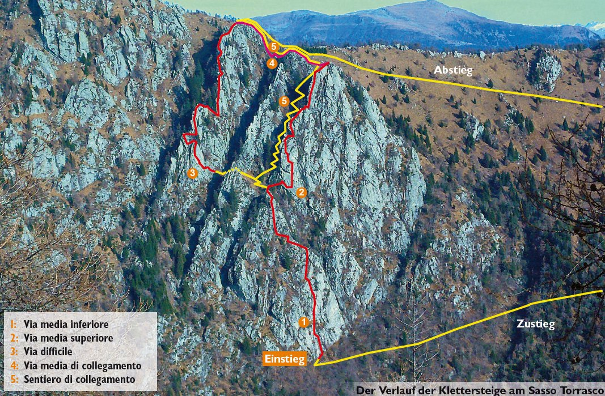
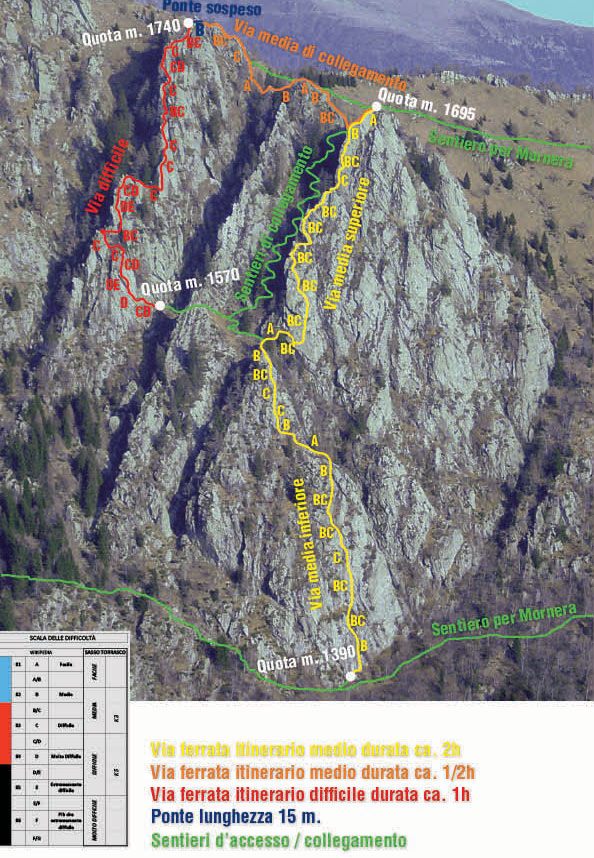



## Location



# Via Media


# Via Difficile


The Via Ferrata dei Tre Signori is one of the most spectacular and airy protected climbing routes in the Canton of Ticino. It is located on the vertical rock face of Sasso Torrasco (between Mornera and Albagno) in the Sementina Valley, right above Monte Carasso and Bellinzona. The route features distinct variants ranging from medium difficulty (K3) to extremely challenging (K5/K6), culminating in a thrilling 15-meter suspension bridge.

### Shared Start

The route begins with a common vertical slab section before splitting into separate variants.

### Via Media (Medium Route)

Rated C/K3. It is well-equipped with iron steps and rungs, making it suitable for climbers with moderate experience.

### Via Difficile (Difficult Route)

Rated D/E up to K6. An incredibly athletic, exposed, and overhanging route that requires excellent upper body strength and absolute freedom from vertigo.

### Suspension Bridge

Both routes converge near a short optional Tibetan bridge suspended over the abyss, offering panoramic views of the Magadino Plain before the descent.

 👨‍⚖️
Newcomers [MUST sign the waiver form](https://forms.gle/phYLQZ5mvnNeuR9N9), it contains detailed information about the risks difficulty and more 


 📓 
The [Ferrata Together QuickStart Guide](https://docs.google.com/document/d/19oks3FaopmkEDDOAUF163Lo_qWMmBgFS0Ht5TqTf0YA) is a good start to learn how to execute via ferrata in safety, a must read for beginners and experienced climbers. It contains a lot of tips.


## Weather ☀️


Weather can cancel/abort/shorten the event a few days before if weather is not perfect for execution!  
* [BergFex](https://www.bergfex.com/sommer/monte-carasso/wetter/)
* [MeteoSwiss](https://www.meteoschweiz.admin.ch/lokalprognose/monte-carasso/6513.html#forecast-tab=detail-view)

## Season 🗓️

Typically June through late October (conditions permitting)


## Meeting point 📍



## Recommended train 🚂



Zürich HB  -> Monte Carasso by train then take the bus to Urènn/Funivia 

## By Car 🚗



## Cable Car 🚠


You must reserve your seats using this link https://www.mornera.ch/en/cable-car/.
1. Monte-Carasso to Mornera at around 9:15
2. Mornera to Monte-Carasso at around 17:15

The line includes two intermediate stations where passengers can disembark: Curzútt (~600m) (popular for the Carasc Tibetan Bridge) and Pientina (1,000m).

It transitions to an automated, self-service operator framework outside of staff hours. Note that it closes briefly on Wednesdays from 08:00 to 10:00 for routine maintenance.


 👨‍⚖️
If you miss your time slot, or somebody take your seat (punch it!) you'll have to wait till there is a no show or enough space in the cabin!
This could be after 19:20 or later. A lot of locals are going down late with their garbage bag.


## Approach hike 🥾






## Exit hike 🚶🏻‍♂️





## GPX 🗺️


## WhatsApp group 💬



## Renting equipment 🛍️
Restaurant near cable car at the top.
Equipment rental at Grotto Mornera to be booked at 091 825 84 38 (helmet + set CHF 30.00) Or bringing your own Via Ferrata complete set.

## My review ⭐️

Beginner friendly (right path)

- Scenic but not much, forest
- Access 45min walk, 15min up then flat in the forest
- Exit 45min flat then down
- Cable car ticket must be reserved online
- More some incline walls and ridge climb
- No help of iron steps, only safety cable, easy to grab rocks and use shoes friction
- Recommend to do right path then trek down 15min then do the left more difficult path (technically demanding, physically brutal)

## Links 🔗
- [Ticino](https://www.ticino.ch/de/commons/details/Via-Ferrata-dei-Tre-Signori/83778.html)
- [Mornera](https://www.mornera.ch/my-product/via-ferrata-dei-tre-signori/)

## Topography 🗺️ 

## Gallery 🌄



## 📆 Ferrata Together log

Ferrata Together visits:
| Date | Number of people | Organizer |
|----------|--------------------|--------------------|
| 6 Sept 2026 | 4 | Cédric Walter |
| 3 Mai 2026 | 1 | Cédric Walter |