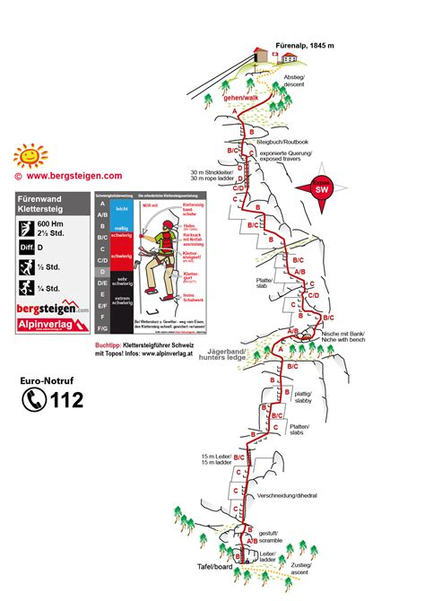





## Location


## Route overview ℹ️

Following 750 m up a steep exposed wall, mostly on metal bars or rods. Very airy throughout the entire route, you should not be afraid of heights on this one.

The route tackles a 600-meter sheer limestone wall (the Fürenhochflue). It is heavily engineered with hundreds of steel pins, iron rungs, and staples. You will have very little direct rock contact, meaning it relies heavily on upper body and arm strength.

### The Jägerband
Roughly halfway up the 250-meter lower wall, the exposure breaks briefly at a lightly wooded, grassy ledge equipped with a wooden bench—the perfect spot to rest your arms.

### The Rope Ladder (K5 part)
The grand finale of the route is an iconic, highly exposed 19-to-30-meter wire-rope ladder that hangs slightly over the void. While it is well-fixed to prevent excessive swaying, it requires a steady mind and no fear of heights.

### No Emergency Exit
Once you progress past the initial sections, there is no way to abort the route. You must top out at the Fürenalp plateau.

 👨‍⚖️
Newcomers [MUST sign the waiver form](https://forms.gle/phYLQZ5mvnNeuR9N9), it contains detailed information about the risks difficulty and more 


 📓 
The [Ferrata Together QuickStart Guide](https://docs.google.com/document/d/19oks3FaopmkEDDOAUF163Lo_qWMmBgFS0Ht5TqTf0YA) is a good start to learn how to execute via ferrata in safety, a must read for beginners and experienced climbers. It contains a lot of tips.


## Duration ⏱️
2-3 hours total

## Weather ☀️
Weather can cancel/abort/shorten the event a few days before if weather is not perfect for execution!  


- [MeteoSwiss](https://www.meteoschweiz.admin.ch/lokalprognose/titlis.html#forecast-tab=detail-view)

## Season 🗓️
Typically June through late October (conditions permitting)


## Meeting point 📍



## Recommended train 🚂



## Cable Car 🚠 1845m
You can avoid the long trek down by taking the Luftseilbahn Engelberg-Fürenalp form the top of the via ferrrata.

[timetable](https://www.fuerenalp.ch/oeffnungszeiten)

## GPX 🗺️
TODO

## Approach hike 🥾




Leave the parking area at the valley station of the Fürenalp Cable Car (Luftseilbahn Engelberg-Fürenalp)
Part of approach on street road, 15min in the forest. At about 1,140 meters, you will reach a distinct signpost marked "Klettersteig-Fürenwand". Turn left here onto the blue-white-blue alpine hiking path. Follow the zigzag trail up the scree slope for another 10–15 minutes until you reach the official starting sign and cable entry point at 1,240 meters


## Exit 🚶🏻‍♂️




From Fürenalp summit → trail to Engelberg (1h) or cable car down


## Travelling home 🏡

by public transportation

## WhatsApp group 💬 



## Water 🚰 
No access to water for 2 hours!

Restaurant 1,845 meters

## Lake 🏊
A small reservoir at the top on the right path leading to the restaurant, big enough for 4-5 persons

## Renting equipment 🛍️ 
Via ferrata sets with helmets can be rented at the Fürenalp valley station. We recommend reserving via ferrata sets by telephone on 041 637 20 94 (opening hours 8:30 - 17:30) or by e-mail. 

A limited number of via ferrata sets (helmet, climbing harness, slings) are available.

Send an email to: 
- [info@fuerenalp.ch](mailto:info@fuerenalp.ch) or
- [bahn@fuerenalp.ch](mailto:bahn@fuerenalp.ch) 
to reserve now, we will be there around 10:00

- Cost via ferrata set complete: CHF 25.00
- Cost via ferrata set slings: CHF 15.00

## Links 🔗
- https://www.instagram.com/reel/DRAN2p6DUiT/?igsh=MTkxbjhpNzNkZ2d5Yw%3D%3D
- https://www.fuerenalp.ch/klettersteig

## My review ⭐️
Beginner friendly if you master techniques

- Easy access
- Scenic
- Vertical +700m
- Trek in the middle of the wall
- Last ladder 40m is rated K5, use proper technique to pass it
- Easy exit to restaurant 15min 
- Cable car down or trek
- 👙🩳 very small water reservoir at the top (left path after door), good for feet or short body immersion

## Topography 🗺️ 

## Gallery 🌄 


