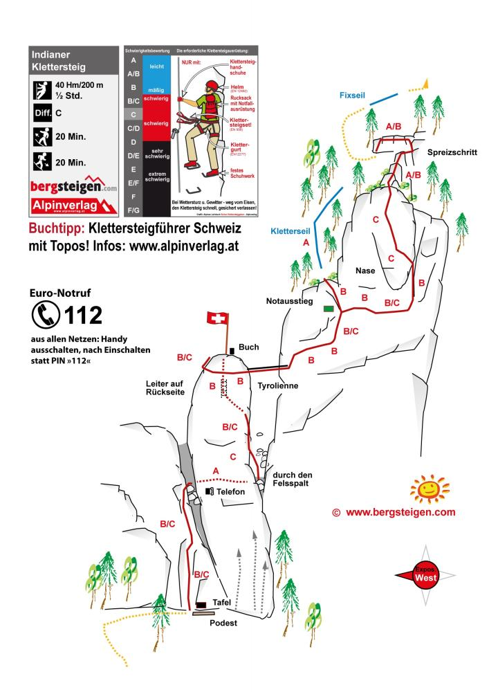





## Location


 👨‍⚖️
Newcomers [MUST sign the waiver form](https://forms.gle/phYLQZ5mvnNeuR9N9), it contains detailed information about the risks difficulty and more


 📓 
The [Ferrata Together QuickStart Guide](https://docs.google.com/document/d/19oks3FaopmkEDDOAUF163Lo_qWMmBgFS0Ht5TqTf0YA) is a good start to learn how to execute via ferrata in safety, a must read for beginners and experienced climbers. It contains a lot of tips.


## Route overview ℹ️
The Indianer Klettersteig is a short, highly varied, and thrilling via ferrata located in Netstal, Canton Glarus, Switzerland. Originally built as a private family project, this route features unique, playful, and creative "homemade" safety elements alongside standard wire cables. It is highly exposed and arm-intensive, meaning it is not suitable for beginners

## Weather ☀️

Weather can cancel/abort/shorten the event a few days before if weather is not perfect for execution!  



Source:
[xxxxm xxxx](xxxx)

## Season 🗓️

Typically June through late October (conditions permitting)



## Meeting point 📍



## Recommended train 🚂



## Cable cars 🚠
None

## By Car 🚗

You can drive to the Via Ferrata Indianer from Zürich in about one hour by taking the A3 motorway and exiting toward Glarus
Take the A3 from Zürich toward Chur, then take Exit 44 (Schänis/Glarnerland) and follow the main road toward Glarus / Netstal.



## Parking 🅿️

Head to Netstal and park near the designated starting area / Oberlanggüetli parking area close to the Linth river and Schlattstein



## Approach hike 🥾




Follow the "INDI" or signposted gravel path from the parking lot through the meadow and forest for about 20 to 30 minutes to reach the base.


## Exit hike 🚶🏻‍♂️





## Travelling home 🏠

xxxx

## WhatsApp group 💬



## Water 🚰
No access for the duration of the via ferrata.

Get water or drinks at
xxxx

## WC 🚾 🚽
xxxx

## Renting equipment 🛍️

xxxx

## Donation 💶
xxxx

## Defects ⛓️‍💥

Noticing some defects during the climb? contact immediately:



## Links 🔗

- xxxx

## My review ⭐️
- xxxx

## Topography 🗺️

## Gallery 🌄



## Video 🎥

## GPX 🗺️
 

## MAP 🗺️

## 📆 Ferrata Together log

Ferrata Together visits:
| Date | Number of people | Organizer |
|----------|--------------------| ---- |
