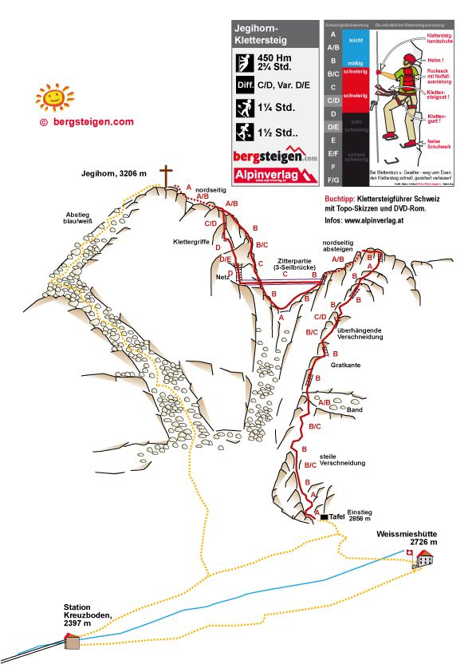
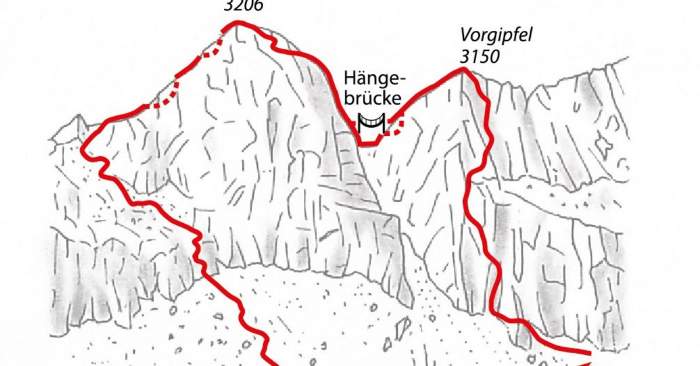





## Location


## Flyover Jegihorn via ferrata


## Route overview ℹ️

The Jegihorn Via Ferrata is one of the most thrilling and scenic high-altitude routes in Switzerland, offering an unforgettable vertical adventure in the heart of the Saas Valley. Perched high above Saas-Grund, this route takes you to the summit of the Jegihorn at 3,206 meters, making it one of the highest via ferratas in the Western Alps.
As you ascend, you are treated to a masterclass in alpine grandeur, with jaw-dropping, panoramic views of the Mischabel Hanseg—including the perfectly shaped pyramid of the Weissmies and the towering Dom. The route perfectly balances pure exposure with excellent protection, featuring iron rungs, steep ladders, and a dramatic, optional 65-meter suspension bridge that will get any adventurer's adrenaline pumping. Whether you tackle the challenging traditional route or the demanding, athletic variation, reaching the summit cross rewards you with the ultimate feeling of conquering a true alpine peak.

1,000 metres of steel cable, 400 anchor points, and a stomach-churning suspension bridge, 5 ladders secure the path.

Near the upper portion of the face (around the lower peak at 3,093m), the route offers a dramatic split where you must choose between two starkly different finishes:

### The Normal Route - Ridge Finish (K4) 
Follows a beautiful, direct line along the natural ridge to the main summit. It maintains a steady climbing rhythm with good rock contact and is technically less exhausting than the variation.

### The Expert Variant - The Bridge (K5)
An athletic, highly exposed alternative designed for experts only. It features a 65-meter three-cable suspension bridge swaying across a deep, stomach-churning abyss, immediately followed by an intense, vertical wall climb.

 📓 
Time is your worst enemy! you can NOT start aroung 9:00AM: You'll have to run down to not miss the last cable car. Start Earlier!


 👨‍⚖️
Newcomers [MUST sign the waiver form](https://forms.gle/phYLQZ5mvnNeuR9N9), it contains detailed information about the risks difficulty and more 


 📓 
The [Ferrata Together QuickStart Guide](https://docs.google.com/document/d/19oks3FaopmkEDDOAUF163Lo_qWMmBgFS0Ht5TqTf0YA) is a good start to learn how to execute via ferrata in safety, a must read for beginners and experienced climbers. It contains a lot of tips.


## Weather ☀️
Weather can cancel/abort/shorten the event a few days before if weather is not perfect for execution!  


[MeteoSwiss 2700m ](https://www.meteoschweiz.admin.ch/lokalprognose/weissmieshuette-sac.html#forecast-tab=detail-view)
And city 
[MeteoSwiss city](https://www.meteoschweiz.admin.ch/lokalprognose/saas-grund/3910.html#forecast-tab=detail-view)

## Season 🗓️
Typically June through late October (conditions permitting)


## Meeting point 📍



## Recommended train 🚂



Train Zürich HB to Visp
Train Visp to Saas Grund
Bus Saas Grund to Saas Grund Cable car 
Saas Grund Cable car to [Kreuzboden](http://www.hohsaas.info/index.php/bahnen)

## 🚠 Cable Car
[Kreuzboden](http://www.hohsaas.info/index.php/bahnen) 08:00 to 16:30 

[Timetable of cable car](https://www.saas-fee.ch/de/services-informationen/tarife-fahrplaene-bergbahnen/fahrplaene-bergbahnen/fahrplaene-bergbahnen/sommer/saas-grund)

## Map 🗺️


## GPX 🗺️


## Start 🏁 




From the [cable car station at Kreuzboden](http://www.hohsaas.info/index.php/bahnen) (2,397 m), hike up to the Weissmieshütte (2,726 m). Next, walk north on a flat trail to the valley near the Fletschhorn glacier and Jegihorn. At point 2,739, turn north and climb to the start of the via ferrata.


## End 🎯

[Jegihorn top](https://www.sac-cas.ch/en/huts-and-tours/sac-route-portal/jegihorn-saas-grund-7799/via-ferrata/panorama-jegihorn-via-ferrata-728/) at 3206m

## Exit 🚶🏻‍♂️




The descent is a demanding SAC T3/T4 alpine trek. You must navigate down a steep, un-secured channel filled with loose rock rubble and moraines where absolute sure-footedness is non-negotiable. In the early summer months (June to early July), this section frequently harbors dangerous snowfields that require extra caution or specialized tracking.

You MUST catch the last gondola down from Kreuzboden, to avoid 1,100 metres of further descent back in the valley.


## Travelling home
by public transportation

## WhatsApp group 💬 



## Water 🚰
The south-facing route is exposed to the sun all day, throughout the season. No access to water for 7-8 hours!

Get water or drinks at
- [Bergrestaurant Kreuzboden](https://maps.app.goo.gl/KCPTJuwrbcYg29bW8)
- [Weissmiesshütte SAC](https://maps.app.goo.gl/CgPfLtSCdHEpm1dXA)

## WC 🚾 🚽
- [Bergrestaurant Kreuzboden](https://maps.app.goo.gl/KCPTJuwrbcYg29bW8)
- [Weissmiesshütte SAC](https://maps.app.goo.gl/CgPfLtSCdHEpm1dXA)

## Renting equipment 🛍️
Please send an email now or call and reserve a via ferrata set with helmet for this satursday:





## Lake
[Artificial lake](https://maps.app.goo.gl/dAU86g2HoymQCRkU9)  Where you can bath or put your feet in after this long 7h day of efforts.

## Links 🔗
- www.off-the-trail.de/jegihorn 
- https://www.sac-cas.ch/en/huts-and-tours/sac-route-portal/jegihorn-saas-grund-7799/via-ferrata/
- https://www.bergsteigen.com/touren/klettersteig/jegihorn-klettersteig/
- https://www.valais.ch/en/explore/activities/other-summer-activities/fixed-rope-routes/via-ferrata-jaegihorn

## Useful contacts







## My review ⭐️
Beginner friendly but demanding and long day 7h minimum

- Very scenic, red stone, lunar, very high
- Most beautiful we made
- Highest via ferrata 3206m
- Access 2h up 500m
- Climb 600m
- No help of iron steps, only safety cable, grab rocks and use shoes friction. Use side-pulls, stemming, and body-spreading against opposing rock faces. More a real climb than a via ferrata 
- Exit down very demanding 2.5h+ -1100m
- Run if you start at 9:00 to catch last cable car at 5:45, better start at 7:00
- Impressive bridge but easy at the end
- After bridge, on top rated K5/K6, lot of frictions and demanding
- Before bridge on right side a K3 if you are not sure
- No access to water for 7h
- Less oxygen at 3200m, possible dizziness
- 👙🩳 Nice artificial lake to put your feet on or swim after the climb if you have time

## Topography 🗺️

## Gallery 🌄



