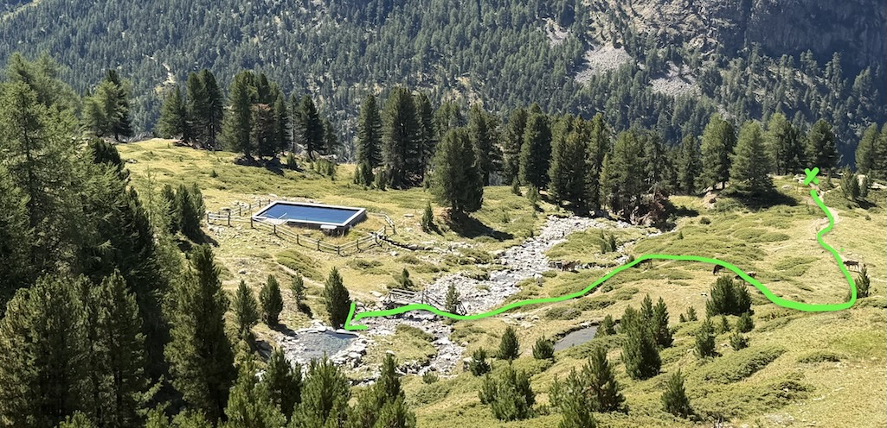
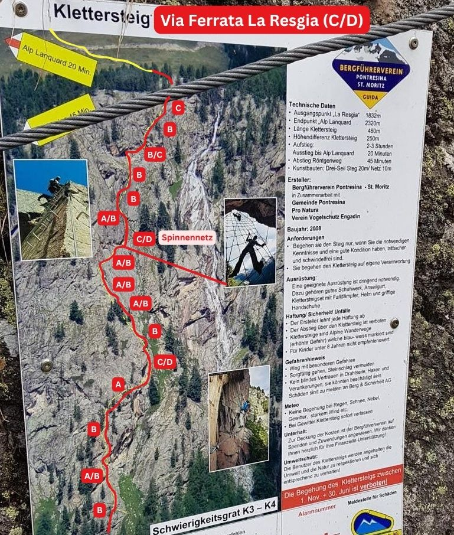





## Location


## Route overview ℹ️

The via ferrata La Resgia (K4) can be easily combined with the via ferrata Languard (K5)
A very nice Ferrata with 2 options to choose in the middle. 1 is with overhang, quite demanding. 

- [La Resgia K4](https://www.sac-cas.ch/en/huts-and-tours/sac-route-portal/la-resgia-7790/via-ferrata/la-resgia-via-ferrata-709/)
- [Languard K5](https://www.sac-cas.ch/en/huts-and-tours/sac-route-portal/la-resgia-7790/via-ferrata/languard-via-ferrata-754/)

Has 382 metal steps and 620 meters of wire rope;

 👨‍⚖️
Newcomers [MUST sign the waiver form](https://forms.gle/phYLQZ5mvnNeuR9N9), it contains detailed information about the risks difficulty and more 


 📓 
The [Ferrata Together QuickStart Guide](https://docs.google.com/document/d/19oks3FaopmkEDDOAUF163Lo_qWMmBgFS0Ht5TqTf0YA) is a good start to learn how to execute via ferrata in safety, a must read for beginners and experienced climbers. It contains a lot of tips.


## Weather ☀️
Weather can cancel/abort/shorten the event a few days before if weather is not perfect for execution!  


- [MeteoSwiss](https://www.meteoschweiz.admin.ch/lokalprognose/pontresina/7504.html#forecast-tab=detail-view)

## Season 🗓️
Typically June through late October (conditions permitting)
- Open: 7 June to 31 October 2026.
- Closed: 1 November to 1 June. Climbing during this time is strictly banned to protect the local wildlife.


## Difficulty 📈 
C-D, +250m, 3h 
Ferrata: 46.4836°, 9.9168°

## Meeting point 📍



Recommended is to take an earlier train through, so you have more reserve time for the last K5 (optional) and enough time to reach the chairlift.

## Recommended train 🚂



## 🚗 Pontresina, Hotel Palü, Via da Bernina, 2h50
To drive to the La Resgia via ferrata, navigate to Pontresina in the Engadine valley of Switzerland. Head toward the southeastern exit of the village on the road toward the Bernina Pass, park near the Resgia parking area or close to Hotel Palü, and walk a few minutes to the trailhead.

[Google map directions](https://maps.app.goo.gl/7SvuiYJyyTVuwGxB7)

## 🚠 chairlift
A bit expensive one way for 20.50 CHF to go down back to the valley (but very very long ride)

- [chairlift top station near Bergrestaurant Alp Languard](https://maps.app.goo.gl/CtvZ6zAik5opkd2LA)
- [chairlift bottom station](https://www.google.com/maps/place/Sesselbahn+Alp+Languard/@46.4910248,9.9039727,534m/data=!3m1!1e3!4m14!1m7!3m6!1s0x47837d0fb40149a3:0xf0c75ea3bf32b22a!2sSesselbahn+Alp+Languard!8m2!3d46.4910248!4d9.906553!16s%2Fg%2F11tf81rtmg!3m5!1s0x47837d0fb40149a3:0xf0c75ea3bf32b22a!8m2!3d46.4910248!4d9.906553!16s%2Fg%2F11tf81rtmg?entry=ttu&g_ep=EgoyMDI2MDgyNi4wIKXMDSoASAFQAw%3D%3D)

## 🅿️ Parking
Park at the designated Resgia parking area on the edge of town.

46.4813°, 9.9151°
Attention: 3.- CHF per hour!

## Approach hike 🥾




Walk a short distance back toward the south side of town, directly behind Hotel Palü on the left side of the valley, where the modern approach path to the base of the waterfall is clearly signposted.


[Via Ferrata La Resgia in google map](https://maps.app.goo.gl/673r2epps9942s7z9)

## End 🎯
- 2198m La Resgia (K4)
- 2328m Alp Languard (K5)

## Exit 🚶🏻‍♂️




[SAC Link](https://www.sac-cas.ch/en/huts-and-tours/sac-route-portal/la-resgia-7790/mountain-hiking/descent-from-la-resgia-languard-ferrata-868/)


# Travelling home
by public transportation

## WhatsApp group 💬 



## Water 🚰 
The route is exposed to the sun from 9:00, throughout the season. No access to water for 2-3 hours!

At the top, the [Bergrestaurant Alp Languard](https://maps.app.goo.gl/CtvZ6zAik5opkd2LA) is close and offer drinks, meals and toilets

## WC 🚾 🚽
the [Bergrestaurant Alp Languard](https://maps.app.goo.gl/CtvZ6zAik5opkd2LA) is close and offer drinks, meals and toilets

## 🏊 Lake
At the top, 5 min walk and you can take a litle swim behind the small dam in the rivier. Head to the right path, there is a small river dam to bath into (before the one with wood fences)

## Renting equipment 🛍️
You can easily rent a via ferrata set (harness, lanyard with energy absorber, and helmet) right in the village of Pontresina. It is highly recommended to reserve your gear in advance during weekends or busy periods.



## Links 🔗
- [ferrataguide](https://ferrataguide.com/ferrata/Klettersteig_La_Resgia)
- [bergsteigen](https://www.bergsteigen.com/touren/klettersteig/klettersteig-la-resgia/)
- [SAC](https://www.sac-cas.ch/en/huts-and-tours/sac-route-portal/la-resgia-7790/via-ferrata/)
- [Komoot](https://www.komoot.com/highlight/4756604)

## My review ⭐️

### La Resgia:
- No easy via ferrata rental
- Easy access in 15min T1 from bus station Pontresina, Palü
- Well secured and easy
- At one point K3 or K4 that rejoin later
- Did K4, has overhand and force changing side on a ridge, original but require technique and strength
- Nice big wood seat in the middle to enjoy the panorama 
- Steel nest at one point require proper locking and hurt a bit the arm 
- Going back by chair lift is 20.5.- CHF
- 👙🩳 River and small dam at the top, head to the right path, there is a small river dam to bath into (before the one with wood fences)

### Languard
- Can be done after La Resgia 
- Easy access 25min easy T2 slightly up but continuous 
- Short and intense climb, lot of overhang that require upper arm strength and straight arms techniques
- Being tall is a plus
- Exit trek easy T1 less than 10min to restaurant a bit pricey because accessible by chair lift
- Cold wind while seated in restaurant terrasse, don't forget a wind stopper.
- Retour walking down or taking chair lift 
- Going back by chair lift is 20.5.- CHF

## Topography 🗺️ 

## Gallery 🌄 


