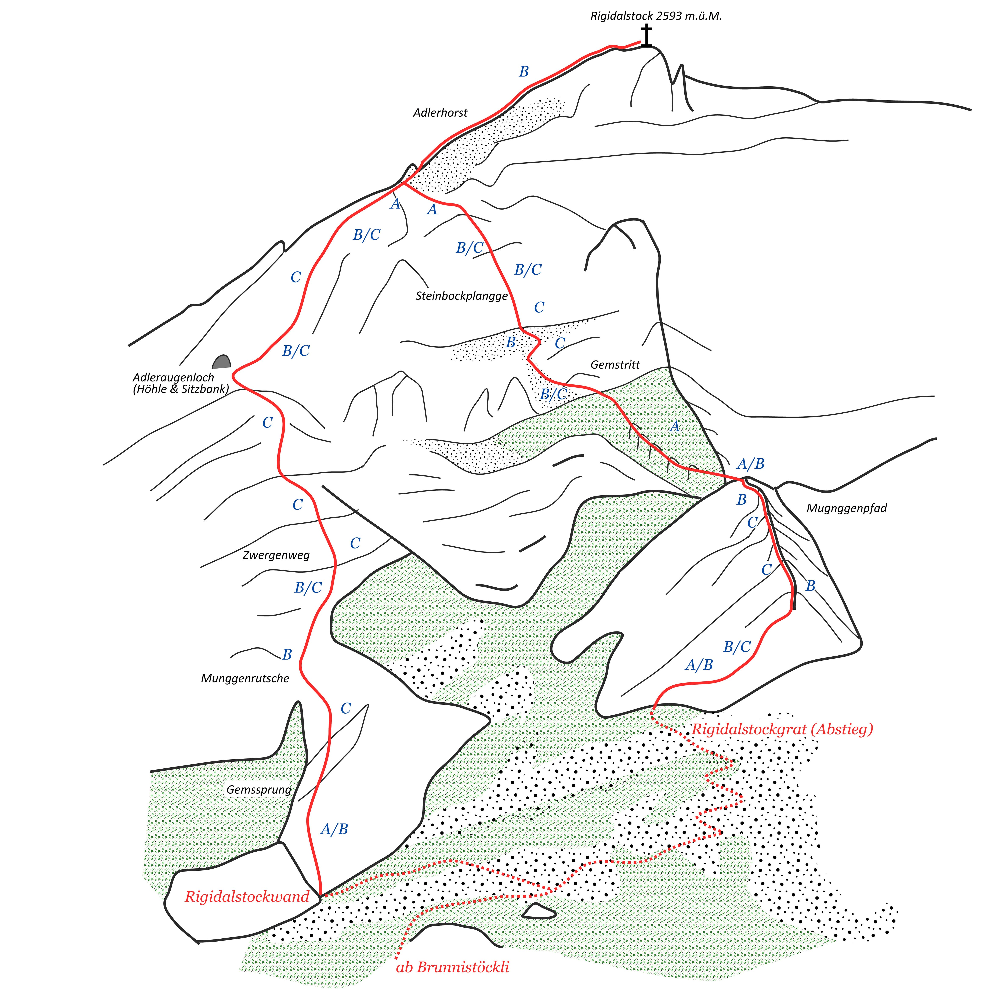





## Location


## Flyover Rigidalstockgrat via ferrata


## Route overview ℹ️

Nestled within the breathtaking landscapes of Switzerland lies a via ferrata that promises adventure-seekers an unforgettable journey. Via Ferrata Rigidalstockgrat, often referred to as Rigidalstockgrat, is a hidden gem among the Swiss Alps’ many climbing routes. In this blog post, we’ll take you on a virtual tour of this exhilarating via ferrata, sharing all you need to know to prepare for and embark on this thrilling alpine experience. ## Understanding Via Ferrata Before we delve into the specifics of Via Ferrata Rigidalstockgrat, let’s clarify what a via ferrata is. Originating from Italian, “via ferrata” translates to “iron path.” These climbing routes are characterized by steel cables, ladders, and rungs anchored to the rock, allowing climbers to ascend steep terrain safely. Via ferratas blend the thrill of climbing with the accessibility of hiking, making them accessible to a wide range of adventurers.

 📓 
Time is your worst enemy! you can NOT start aroung 9:00AM and do Brunnistockli (K2) or Zittergrat AND then Rigidalstockgrat! You ll have to run down to not miss the last cable car. Start Earlier! and avoid the easy Brunnistockli (K2).


 👨‍⚖️
Newcomers [MUST sign the waiver form](https://forms.gle/phYLQZ5mvnNeuR9N9), it contains detailed information about the risks difficulty and more 


 📓 
The [Ferrata Together QuickStart Guide](https://docs.google.com/document/d/19oks3FaopmkEDDOAUF163Lo_qWMmBgFS0Ht5TqTf0YA) is a good start to learn how to execute via ferrata in safety, a must read for beginners and experienced climbers. It contains a lot of tips.


## Season 🗓️
Typically June through late October (conditions permitting)



## Weather ☀️
Weather can cancel/abort/shorten the event a few days before if weather is not perfect for execution!  


Source:
- [MeteoSwiss](https://www.meteoschweiz.admin.ch/lokalprognose/brunnihuette-sac.html#forecast-tab=detail-view)

## Meeting Point 📍



## Recommended train 🚂


## 🚠  Cable Car

From the main station of Engelberg, take the bus to Brunni, a short cable car followed by a chair list
Cost 27.-

Brunni-Bahnen Engelberg AG, 6390 Engelberg, Switzerland

## GPX 🗺️

I recommend doing the left path (Rigidalstock face (D/K4)) climbing up and going down using the Rigidalstock ridge (C/K3).
Beginner will prefer doing the Rigidalstock ridge (C/K3) up and down.

## Approach trek




2 hours exhausting trek up


## Approach trek




2 hours exhausting trek down


### Rigidalstock face (D/K4)



### Rigidalstock ridge (C/K3)



## Travelling home 🏡

by public transportation

## WhatsApp group 💬 



## Water 🚰 
The route is exposed to the sun from 9:00 in summer, throughout the season. 
No access to water for 7 hours!

Get Water at Brunnihütte

## 🏊 Lake
A small artificial lake is welcoming you beside the top of the chairlift. Even just putting your feets inside is great after this long day!

## Renting equipment 🛍️

## Links 🔗
- [SAC](https://www.sac-cas.ch/de/huetten-und-touren/sac-tourenportal/rigidalstock-1499/klettersteig/klettersteig-rigidalstockgrat-741/)
- [Outdoor active](https://www.outdooractive.com/en/route/via-ferrata/engelberg/via-ferratas-on-the-rigidalstock-near-engelberg-titlis/800289342/#dmdtab=oax-tab1)
- [BergFex](https://www.bergfex.com/sommer/luzern-vierwaldstaettersee/touren/klettersteig/616552,klettersteige-brunnistoeckli-und-rigidalstock/)
- [Viva Ferrata](https://vivaferrata.ch/en/route/brunni-engelberg/rigidalstockgrat?map=8.41145%2C46.84638%2C14)

## My review ⭐️

The uphill approach walk is really demanding, took me 2h without break from Brunnistöckli. The walk ended being more difficult than the K3 due to the steepness, small rocks limiting speed and making the road hazardous. A good self balance and sure footness is required!

There is no water source on the road, I recommend to have 3 litres or more and hide the bottles on the path up to avoid transporting them to the summit and down. I was having 0.5 liter water and when back at the station drank 1.5l in one shot: I was clearly dehydrated!

Reserve enough time! 2h uphill approach, 1.5h climbing, 45min climbing down and 2h walk to reach the valley. Last chair-lift at 16:30, Last cable car at 17:00 It is a lot colder than in the middle station, summit via ferrata is at 2593m, so be prepared and use a wind stopper coat.

The walk is really demanding, expect to suffer a lot more than on the via ferrata! Don’t go left at the beginning of the via ferrata: on the left (Rigidalstockgrat west) this is a K4, K4.5 (a wall): it is not for beginner! you can only go uphill.

Experienced climbers start with the Rigidalstockgrat west (K4-K4.5) and go down with the Rigidalstockgrat (K3). I met some experienced climbers and they said the track has changed and some part is now a K4.5. The Rigidalstockgrat is K3 and easy, You won’t fear heights.

One section of this via ferrata is difficult, where there are 5 stairs, use the steel cable if you feel in danger, are panicking, with your both hands. You will have to climb this via ferrata up and then down.

Beginner friendly but demanding and long day

- Rigidalstockgrat demanding trek up of 2h
- Left path is a light K4+
- Right path is K3 and can be climb up and down climb
- Recommend to do Left path up and right path down or do right path up and down
- Attention down climbing is not so easy for some people
- Demanding trek down of 3h
- No access to water for 7h
- The last cable car is too early! Don’t do Brunnistockli and Rigidalstockgrat or start very very early (not around 9:00!)
- 👙🩳 Nice artificial lake to put your feet on or swim after the climb if you have time

## Topography 🗺️ 

## Gallery 🌄 


## 📆 Ferrata Together log
Ferrata Together visits:
| Date | Number of people |
|----------|--------------------|
| 14 June 2026 | 14 |
| 20 Sept 2025 | 8 |
| 2023 | 1 |