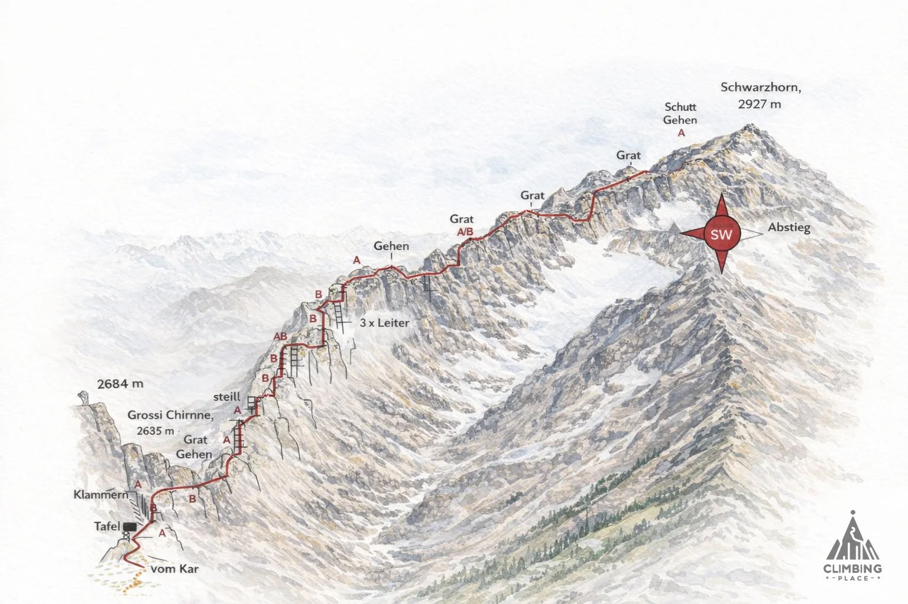








Not executed yet 🥲


The Schwarzhorn Via Ferrata near Grindelwald is a moderately difficult (K3) alpine climb leading to the 2,928-meter summit of the Schwarzhorn, offering sweeping panoramic views of the Bernese Alps. Overall a very easy Ferrata (more like an Alpine path with some ladders).
Airily staggered aluminum ladders on steep vertical rock faces and an exposed ridge traverse

 👨‍⚖️
Newcomers [MUST sign the waiver form](https://forms.gle/phYLQZ5mvnNeuR9N9), it contains detailed information about the risks difficulty and more 


 📓 
The [Ferrata Together QuickStart Guide](https://docs.google.com/document/d/19oks3FaopmkEDDOAUF163Lo_qWMmBgFS0Ht5TqTf0YA) is a good start to learn how to execute via ferrata in safety, a must read for beginners and experienced climbers. It contains a lot of tips.


## Weather ☀️
Weather can cancel/abort/shorten the event a few days before if weather is not perfect for execution!  


Source:
 - [MeteoSwiss](https://www.meteoschweiz.admin.ch/lokalprognose/schwarzhorn.html#forecast-tab=detail-view)

## Meeting Point 📍
6:40AM Zürich HB, Main Meeting point, around the clock Find the turquoise Zürich Together Banner.

## Time of leaving 🏁
6:55AM to platform 31

## Recommended train 🚂: 
To get to the Schwarzhorn via ferrata (above Grindelwald) from Zurich by train, take an SBB train from Zürich HB to Interlaken Ost (via Bern), transfer to the regional train to Grindelwald, take local bus line 121 to the Firstbahn gondola, and ride up to First to begin the hike. Total travel time is around 3.5 to 4 hours one-way.

- Zürich HB to Interlaken Ost: Board the intercity train via Bern or Lucerne. Change trains at Interlaken Ost.
- Interlaken Ost to Grindelwald: Catch the Berner Oberland-Bahn (BOB) regional train directly to Grindelwald station.- Grindelwald to Firstbahn: Walk a short distance from the Grindelwald station to the local bus stop and take Bus 121 (direction: Oberer Gletscher) straight to the Grindelwald Firstbahn stop.
- Gondola to First: Ride the Grindelwald-First Gondola up to the top station at First, which serves as the base for the approach

## By Car 🚗
Drive from Zürich to Grindelwald via Lucerne and the Brünig Pass (approx. 2.5 hours, ~130 km).
Take the A1/A4 out of Zürich, head toward Lucerne, and continue on the A8 over the Brünig Pass toward Interlaken/Grindelwald.Exit: Follow signs through Interlaken to Grindelwald.

## 🅿️ Parking
Park your car at the valley station of the Firstbahn in Grindelwald
46.624°, 8.0429°

## 🚠 Cable car
Back and forth ticket 38 CHF with GA or Half Fare, 76 CHF without anything
- 08:00 to 18:00 [timetable](https://www.jungfrau.ch/de-ch/planen-buchen/fahrplan/?to=First)
- https://www.jungfrau.ch/de-ch/grindelwaldfirst
- [Grindelwald-First Gondola](https://grindelwald.swiss/de/map/detail/grindelwald-first-b8e09f4c-b0e7-439b-a1fa-fb0285e72279.html)

## 🏁 Approach Hike
From the First top station, hike down slightly and follow the trail across green meadows toward Chrinnenboden and on to the base of the ridge at Grosse Chrinne (about 1.5 to 2 hours of walking). 46.6827°, 8.0679° 2400m 

## End 🎯
Takes about 1 to 1.5 hours up steel cables and vertical ladders to reach the peak at 2928-meter.  With views of the Bernese peaks and Lake Thun and Lake Brienz.

## Exit 🚶🏻‍♂️
T3, +90m, -860m, 1h45min. A panoramic trail continues to Grosse Scheidegg, from where the post bus takes us back to Grindelwald. 
- [SAC](https://www.sac-cas.ch/en/huts-and-tours/sac-route-portal/schwarzhoren-schwarzhorn-be-1741/mountain-hiking/descent-from-schwarzhorn-via-the-south-ridge-795/)

## Travelling home 
by public transportation

## WhatsApp group 💬 



## Water 🚰 
No access to water for >6 hours!

## Alpine lake 🏊
Yes/No

## Renting equipment 🛍️

## Links 🔗
- https://www.sac-cas.ch/en/huts-and-tours/sac-route-portal/schwarzhoren-schwarzhorn-be-1741/via-ferrata/
- https://www.outdoor.ch/en/outdoor-mountaineering/via-ferrata-schwarzhorn
- https://ferrataguide.com/ferrata/Schwarzhorn-Klettersteig
- https://www.komoot.com/highlight/589532

## My review ⭐️

## Topography 🗺️ 

## Gallery 🌄 

