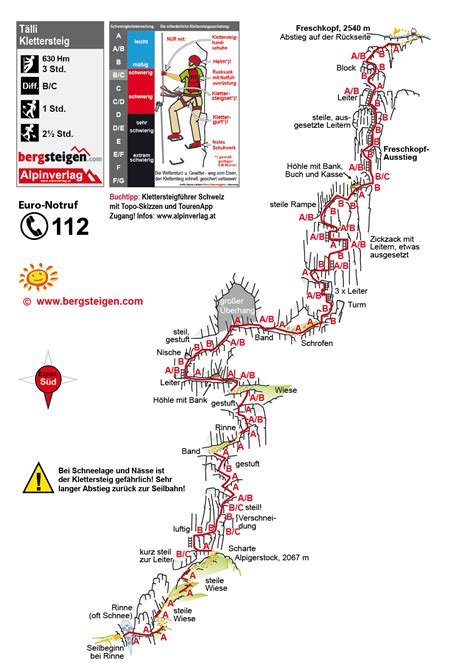



## Location


A scenic and impressive via ferrata in classic style, totalling 14 ladders, iron bars, pins and steel cables for security. The main difficulties are encountered in the lowest section. For the return path, conditions are very important.

 👨‍⚖️
Newcomers [MUST sign the waiver form](https://forms.gle/phYLQZ5mvnNeuR9N9), it contains detailed information about the risks difficulty and more 


 📓 
The [Ferrata Together QuickStart Guide](https://docs.google.com/document/d/19oks3FaopmkEDDOAUF163Lo_qWMmBgFS0Ht5TqTf0YA) is a good start to learn how to execute via ferrata in safety, a must read for beginners and experienced climbers. It contains a lot of tips.


## Weather ☀️ 
Weather can cancel/abort/shorten  the event a few days before if weather is not perfect for execution!
Gadmen area

Source:
- [MeteoSwiss](https://www.meteoschweiz.admin.ch/lokalprognose/taellistock.html#forecast-tab=detail-view)

## Difficulty 📈 
K3, +500m, 3h [SAC Link](https://www.sac-cas.ch/de/huetten-und-touren/sac-tourenportal/gadmerflue-ausstieg-taellistock-klettersteig-7812/klettersteig/taelli-klettersteig-848/)

## Meeting Point 📍
XXXXAM  Zürich HB, Main Meeting point, around the clock
Find the turquoise Zürich Together Banner.

## Time of leaving 🏁
XXXAM to platform XXX

## By Car 🚗
It is **faster and easier** to take the car to join the start of this via ferrata in Sustenpass.
1h52min from Zürich to [Gadmen Tällibahn, Grimselstrasse 19, 3862 Innertkirchen](https://maps.app.goo.gl/RKbtvK73UCJBX78M9)

## Parking 🅿️ 
[Located beside the Tällibahn](https://maps.app.goo.gl/AGnXi8PmDybjG3cN7), it is free - up to 50 cars - Sustenstrasse 190, 3863 Innertkirchen - 1174m

## Recommended train 🚂
- 3h 15 min  
- 06:10 platform 6
- 9:10 arrival at Tällibahn
- https://a.sbbmobile.ch/s/Gb6VKwsU

## 🚠 Cable car
Tällibahn cable car has a capacity of 8 people, or 4 people seated. It ascends to an altitude of 1714 meters, covering a vertical gain of 540 meters in 7 minutes. The route is 1236 meters long. The cable car belongs to the Oberhasli power company and was opened in 1957. Tickets can be purchased online, at the Grimseltor Tourist Center in Innertkirchen, and at the ticket machines (cashless only) at the valley and mountain stations of the Tällibahn.

- Self service cable car
- Operating from 07:00 to 21:30 
- 18.- CHF back and forth
- [Tällibahn](https://www.grimselwelt.ch/bahnen/taellibahn/) 

## Map 🗺️


## GPX 🗺️ full trip


## GPX 🗺️ exit path to Hütte


## Start 🏁
[SAC Link](https://www.sac-cas.ch/de/huetten-und-touren/sac-tourenportal/gadmerflue-ausstieg-taellistock-klettersteig-7812/berg-und-alpinwandern/zustieg-zum-taelli-klettersteig-849/)

## Exit 🚶🏻‍♂️
[SAC Link](https://www.sac-cas.ch/de/huetten-und-touren/sac-tourenportal/gadmerflue-ausstieg-taellistock-klettersteig-7812/berg-und-alpinwandern/abstieg-vom-taelli-klettersteig-zur-taellihuette-oder-engstlenalp-850/)

## Travelling home: by public transportation

## WhatsApp group 💬 



## Water 🚰 
enough for 7-8h of efforts

## Links 🔗
- https://www.sac-cas.ch/de/huetten-und-touren/sac-tourenportal/berggasthaus-taelli-2147000263/
- https://ferrataguide.com/ferrata/T%C3%A4lli_Klettersteig

## 🛟 Contacts

### Berggasthaus Tälli
Absolutely stunning location, beautiful views, friendly people and affordable.
- Mountain cabin in Innertkirchen
- [www.taelli.ch](https://www.taelli.ch)
- Phone 033 975 14 10

## My review ⭐️
Beginner friendly but demanding and long day 7h minimum

- Very scenic
- Nice Hütte with easy access
- Very very easy lot of iron steps, ladder 19
- Rated at 3h and you need them
- Access 45min from Hütte
- Cable car 18.- back and forth self service from parking
- Exit 2h demanding path down at beginning, last part is +200m and total 1100m down
- No access to water for 7h
- Easier and faster access by car then SBB
- Possibility to drive the Sustenpass up and down	
- 👙🩳 River and lake 2km away right side of the road when driving to the Sustenpass.

## Topography 🗺️ 

## Gallery 🌄 


## 🎥 Video


## 📆 Ferrata Together log
Ferrata Together visits:
| Date | Number of people |
|----------|--------------------|
| 23 August 2026 | 2 |
| 19 Sept 2026 | 8 |