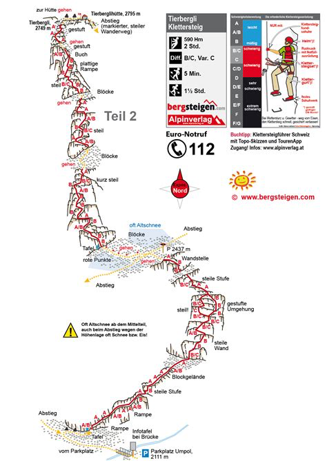





## Location


## Flyover


## Route overview ℹ️
Impressive views of the Gwächtenhorn, Sustenhorn, and the Gadmertal valley open up time and again. Just before the final stretch to the Tierbergli Hut, the panorama widens—and your gaze falls upon the mighty Steingletscher: a true highlight of this tour!

The Tierbergli is a high-alpine via ferrata (rated K3 to K4) that tops out at 2,795 meters. Because it finishes directly at a glacier hut, the descent down the normal mountain trail often crosses snow slopes or icy patches, even in mid-summer. Depending on the current conditions, crampons and an ice axe may be required for the descent. Always check the current track conditions with the Tierberglihütte before heading up.

 👨‍⚖️
Newcomers [MUST sign the waiver form](https://forms.gle/phYLQZ5mvnNeuR9N9), it contains detailed information about the risks difficulty and more 


 📓 
The [Ferrata Together QuickStart Guide](https://docs.google.com/document/d/19oks3FaopmkEDDOAUF163Lo_qWMmBgFS0Ht5TqTf0YA) is a good start to learn how to execute via ferrata in safety, a must read for beginners and experienced climbers. It contains a lot of tips.


## Weather ☀️
Weather can cancel/abort/shorten  the event a few days before if weather is not perfect for execution!
Gadmen area

Source:
- [MeteoSwiss](https://www.meteoschweiz.admin.ch/lokalprognose/sustenpass.html#forecast-tab=detail-view)

## Meeting Point 📍
XXXXAM  Zürich HB, Main Meeting point, around the clock
Find the turquoise Zürich Together Banner.

## Time of leaving 🏁
XXXAM to platform XXX

## Recommended train 🚂
https://a.sbbmobile.ch/s/Eta68VPo

Duration: 4.5H

**Train from Zürich HB:** Take the inter-city or regional train connection heading south towards Interlaken Ost (with a quick transfer typically required in Bern or Spiez depending on the exact morning departure). 

**Connection to Meiringen:** From Interlaken Ost, change to the regional train taking you to Meiringen station.

**PostBus to Steingletscher:** From Meiringen, board the [seasonal PostBus (Line 162)](https://www.postauto.ch/en/leisure-offers/excursion-tips/mountain-pass-routes-in-the-central-alps) travelling up the Sustenpass and disembark at the Steingletscher, Susten stop. **Note that this mountain bus service operates strictly during the summer months.**

**From Steingletscher (1,865 m):** You must hike up via the road passing the Steinsee towards the Umpol parking area (~2,100 m). [Google map hike from Berghotel & Restaurant Steingletscher to parking Umpol](https://www.google.com/maps/place/Berghotel+%26+Restaurant+Steingletscher/@46.7146012,8.4075465,1088m/data=!3m1!1e3!4m26!1m16!4m15!1m6!1m2!1s0x47856391d7133ab3:0x3544760f09820e1!2sBerghotel+%26+Restaurant+Steingletscher,+Sustenstrasse+365,+3863+Steingletscher!2m2!1d8.4279021!2d46.7309509!1m6!1m2!1s0x4785636b483b2079:0x6a0f50684698a254!2sParkplatz+Umpol,+Tierbergli,+3863+Gadmen!2m2!1d8.415933!2d46.7131841!3e0!3m8!1s0x47856391d7133ab3:0x3544760f09820e1!5m2!4m1!1i2!8m2!3d46.7309509!4d8.4279021!16s%2Fg%2F11f6g0c7v1?entry=ttu&g_ep=EgoyMDI2MDkxMy4wIKXMDSoASAFQAw%3D%3D) 

When in the parking Umpol, you cross a bridge, and after 5min youre at [the start of the Via Ferrata](https://maps.app.goo.gl/Pih8J2cLKeTeaqRG7).

## By Car 🚗
It is **faster and easier** to take the car to join the start of this via ferrata in Sustenpass.


Please take note of road closures at the start of winter, for the latest information on the Susten Pass road, visit [www.tcs.ch](https://www.tcs.ch) and [www.alpen-paesse.ch](https://www.alpen-paesse.ch) 


## 🅿️ Parking
You must pay 7.- to take a private road up to the highest parking ([Parking Umpol](https://maps.app.goo.gl/szowUVPffgrvBCRZ8)). If you want to avoid that you'll need to walk up [from the free parking of Berghotel & Restaurant Steingletscher at 1865m](https://maps.app.goo.gl/AbRxx4ucZJhvx2y27) 45min on open raod to the start near the parking Umpol (2100m).

When in the parking Umpol, you cross a bridge, and after 5min youre at [the start of the Via Ferrata](https://maps.app.goo.gl/Pih8J2cLKeTeaqRG7).

## Map 🗺️


## GPX 🗺️


## Travelling home
by public transportation or by car (fastest)

- https://a.sbbmobile.ch/s/bIm0rjZ4 
- https://a.sbbmobile.ch/s/iGbcofnC

## WhatsApp group 💬 



## Water 🚰 

Tierbergli has lot of shadows (north face), carry at least 2 liter of water and warm clothes. After exiting the via ferrata, a Berghutte is only 35min away (still an exhausting walk up)

## Renting equipment 🛍️
Not possible close to start, or around. I recommend from the one joining us to rent their Via Ferrata set at [Transa.ch](https://www.transa.ch) or [Decathlon](https://rent.decathlon.ch/de/de-8754883) 

## Links 🔗:
- [Flyer](https://tierbergli.ch/wp-content/uploads/2021/01/klettersteig-flyer.pdf)
- [ferrataguide](https://ferrataguide.com/ferrata/Klettersteig_Tierbergli)
- [bergsteigen.com](https://www.bergsteigen.com/touren/klettersteig/tierbergli-klettersteig/)
- [komoot.com](https://www.komoot.com/highlight/582275)

## Contacts 🛟




<iframe src="https://www.google.com/maps/embed?pb=!1m18!1m12!1m3!1d2369.225418224392!2d8.411640875671706!3d46.702022050004956!2m3!1f0!2f0!3f0!3m2!1i1024!2i768!4f13.1!3m3!1m2!1s0x47856372cdbc2339%3A0x843f29bfd3f2e495!2sTierberglih%C3%BCtte%20SAC!5e1!3m2!1sen!2sch!4v1789561740916!5m2!1sen!2sch" width="600" height="450" style="border:0;" allowfullscreen="" loading="lazy" referrerpolicy="strict-origin-when-cross-origin"></iframe>

[tierbergli](https://tierbergli.ch)

## My review ⭐️
Beginner friendly but demanding and long day

- Easier and faster access by car then SBB
- Scenic
- Vertical but not much
- Easy access 3min from parking (7 CHF)
- Easy climb with some trek to make it to next sections
- Demanding exit 45min to restaurant
- Demanding path down T3+ of 2.5h back to parking
- 👙🩳 small lak 15min right to the path when going down, glacier water so cold

## Topography 🗺️ 

## Gallery 🌄 


## 🎥 Video


## 📆 Ferrata Together log
Ferrata Together visits:
| Date | Number of people |
|----------|--------------------|
| 4 Juli 2026 | 6 |