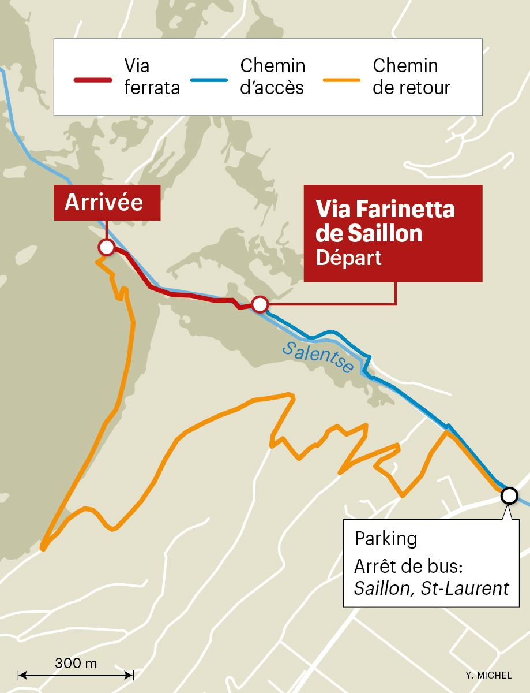
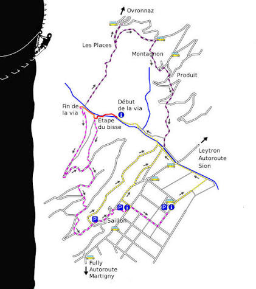
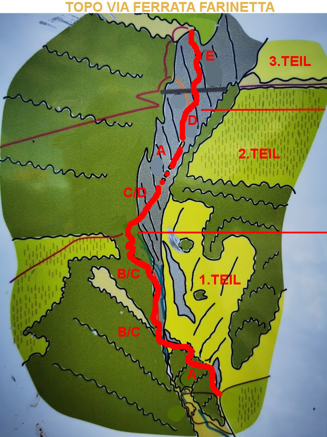







The Via Farinetta leads through the wild and mysterious Salentze Gorge, from which the thermal water for the thermal baths in Saillon also originates.

"Via Farinetta" is a famous, highly demanding sport via ferrata (protected climbing route) located in the Salentze Gorge near Saillon, Valais, Switzerland. It is well known in the mountaineering community for its three progressive sections (ranging from difficulty K3 up to an extremely athletic K5/K6 overhang) and is named after the legendary Swiss counterfeiter Joseph-Samuel Farinet

 👨‍⚖️
Newcomers [MUST sign the waiver form](https://forms.gle/phYLQZ5mvnNeuR9N9), it contains detailed information about the risks difficulty and more 


 📓 
The [Ferrata Together QuickStart Guide](https://docs.google.com/document/d/19oks3FaopmkEDDOAUF163Lo_qWMmBgFS0Ht5TqTf0YA) is a good start to learn how to execute via ferrata in safety, a must read for beginners and experienced climbers. It contains a lot of tips.


## Route overview ℹ️

### Part 1: The Gorge Base
 📓 
K3 to K4, Slightly Difficult / AD+, 2:30–4:30 h, 150 m, beginner accepted,


Follows the deep riverbed environment. Climbers maneuver tight canyon walls, waterfall mist, and cross two monkey bridges.

[SAC](https://www.sac-cas.ch/en/huts-and-tours/sac-route-portal/passerelle-a-farinet-12215/via-ferrata/via-farinetta-section-1-40500/)
Exit possible walking before section 2

### Part 2: The Aerial Walls
 📓 
K4+, Difficult / D+, 3–3:30 h, 100 m,  beginner accepted if section 1 was okay


The route moves out of the shaded floor into exposed, vertical cliffs. Features a traversal through an old historic water pipe tunnel and highly airy steps.

[SAC](https://www.sac-cas.ch/en/huts-and-tours/sac-route-portal/passerelle-a-farinet-12215/via-ferrata/via-farinetta-section-2-40501/)
Exit possible walking before section 3

### Part 3: The Overhangs
 📓 
K5 to K6- Extremely Severe / TD+, 3:30–4:30 h, 50 m, NO BEGINNER, experienced climber only


An extreme, highly exposed vertical wall with intense overhanging rock faces. Requires intense upper-body strength to push through gravity-defying rock geometry.

[SAC](https://www.sac-cas.ch/en/huts-and-tours/sac-route-portal/passerelle-a-farinet-12215/via-ferrata/via-farinetta-section-3-40502/)

## Weather ☀️

Weather can cancel/abort/shorten the event a few days before if weather is not perfect for execution!  

### Strictly closed in winter/wet conditions!

Weather can cancel/abort/shorten the event a few days before if weather is not perfect for execution!  


- [MeteoSwiss](https://www.meteoschweiz.admin.ch/lokalprognose/saillon/1913.html#forecast-tab=detail-view)

## Season 🗓️
Typically March through november (conditions permitting)


## Meeting Point 📍



## Recommended train 🚂



 or

 

To get to the Via Farinetta via ferrata in Saillon from Zurich, take the main SBB train line toward Valais to Riddes or Martigny, switch to regional bus 311 to the Saillon St-Laurent stop, and walk 25 minutes upstream along the Salentze riverbed.

Train from Zurich HB: Board an InterCity (IC1) train toward Brig, typically transferring at Visp or Lausanne depending on the hourly schedule, or take a direct/fewer-transfer connection heading down the Rhône Valley to Riddes or Martigny station. (Total train time is roughly 2.5 to 3 hours)

Bus connection: From Riddes CFF, Martigny CFF, or Sion CFF, catch the PostBus 311 directly to the Saillon St-Laurent bus stop. Check live connections on the SBB Timetable
	
## GPX 🗺️


## Approach hike 🥾




From the Saillon St-Laurent stop, walk toward the Salentze Bridge, cross over, and follow the white signs and local path markers upstream along the river toward the gorge to reach the start of the route.


## Exit 🚶🏻‍♂️



Upon finishing any section or completing the final push to the suspension bridge, the topography changes completely into a gentle descent path leading through the sun-exposed west forest and local Valais vineyards back down to the thermal resort plain.


## Travelling home
by public transportation

## WhatsApp group 💬 



## Water 🚰 
Enough for 3 hours of efforts

## Contacts


## Links 🔗:
- [sac-cas](https://www.sac-cas.ch/en/huts-and-tours/sac-route-portal/passerelle-a-farinet-12215/via-ferrata/)
- [bergsteigen.com](https://www.bergsteigen.com/touren/klettersteig/via-farinetta/)
- [valais.ch](https://www.valais.ch/en/explore/activities/other-summer-activities/fixed-rope-routes/via-farinetta)
- [alltrails.com](https://www.alltrails.com/trail/switzerland/valais/via-ferrata-farinetta-saillon)

## My review ⭐️
- Not executed yet

## Topography 🗺️ 

  

## Gallery 🌄 


## Video 🎥


## 📆 Ferrata Together log
Ferrata Together visits:
| Date | Number of people |
|----------|--------------------|
| x | x |