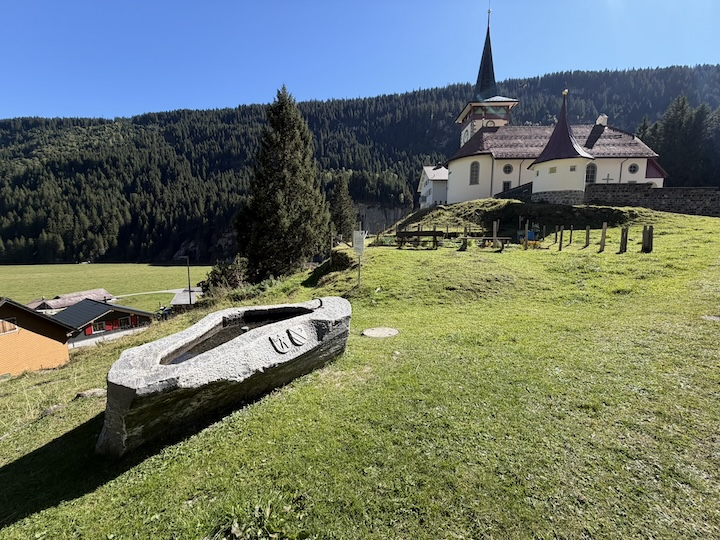
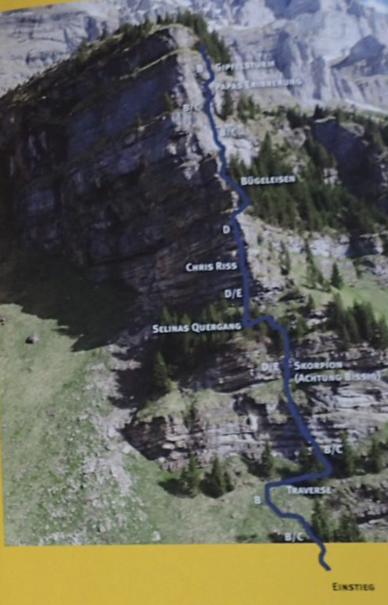





## Location


## Route overview ℹ️
The via ferrata is located at Urnerboden (1372 m above sea level), the largest alpine meadow in Switzerland.

The Zingelstöckli via ferrata is a demanding K4–K5 sports climbing route located above Urnerboden in Switzerland. It features a 300-meter cable length and about 200 meters of vertical gain, offering experienced climbers steep rock walls, an aluminum ladder crux, and stunning alpine views. 
This is a steep, demanding 300-metre sports via ferrata that requires strong upper-body strength and a head for heights.

### Step 1 & 2 (Lower Wall)
Fairly challenging initial vertical rock steps leading straight into an early short overhang requiring strong upper-body grip.

### Step 3 (The Crux)
A slightly overhanging iron ladder flowing directly into another 10 meters of strenuous, slightly overhanging vertical climbing.

### Step 4 (Ledge & Emergency Exit)
Easier vertical progression bringing you to a large cairn and the official emergency exit midway up the wall.

### Step 5 to 8 (Upper Wall & Exit)
Continuous steep climbing via a long dihedral and exposed iron rungs on more brittle rock, topping out at Alp Zingel (1,751 m).

 👨‍⚖️
Newcomers [MUST sign the waiver form](https://forms.gle/phYLQZ5mvnNeuR9N9), it contains detailed information about the risks difficulty and more 


 📓 
The [Ferrata Together QuickStart Guide](https://docs.google.com/document/d/19oks3FaopmkEDDOAUF163Lo_qWMmBgFS0Ht5TqTf0YA) is a good start to learn how to execute via ferrata in safety, a must read for beginners and experienced climbers. It contains a lot of tips.


## Zingelstöckli via ferrata flyover



## Weather ☀️

Weather can cancel/abort/shorten the event a few days before if weather is not perfect for execution!  

### Strictly closed in winter/wet conditions!



Source:
[8751 Urnerboden](https://www.meteoschweiz.admin.ch/lokalprognose/urnerboden/8751.html#forecast-tab=detail-view)

## Season 🗓️

Typically 1. May through 31. October (conditions permitting)



## WhatsApp group 💬 



## Meeting point 📍



## Recommended train 🚂



## By Car 🚗

Drive via the scenic Klausen Pass (1h53 from Zürich) over the pass summit or You can approach from Altdorf directly from Linthal/Glarus up to Urnerboden (1h30 from Zürich).

[Google map](https://www.google.com/maps/dir/Zürich/Klettersteig+Zingelstöckli,+Klausenstrasse,+8751+Spiringen/@47.1200898,8.4231791,110144m/data=!3m1!1e3!4m14!4m13!1m5!1m1!1s0x47900b9749bea219:0xe66e8df1e71fdc03!2m2!1d8.541694!2d47.3768866!1m5!1m1!1s0x47853be461f01d07:0xb60382850217b3bb!2m2!1d8.8994188!2d46.894391!3e0?entry=ttu&g_ep=EgoyMDI2MDkyMS4wIKXMDSoASAFQAw%3D%3D)

## Parking 🅿️

Once you reach the village of Urnerboden, free parking is available directly in the area around the local village church.



## Cable cars 🚠

None

## Approach hike 🏁




From the church parking area, walk back toward the main road. Head to the right side of the abandoned Hotel Wilhelm Tell (or its ruins). A narrow path leads through the meadow and splits off to the right into the forest, marked with blue signs ("Klettersteig") and orange paint markers. Follow this through the trees up to the starting wall.


## Exit routes
An emergency exit is available about halfway up. 

## Exit hike 🚶🏻‍♂️




Once you top out and unclip from the final cable of the via ferrata, make a very brief, gentle uphill walk across the alpine meadow toward the visible huts of [Alp Zingel](https://urneralpen.ch/schaechental/urnerboden-/-fiseten/zingel/) (1,751 m).Local 

[Alp Zingel](https://urneralpen.ch/schaechental/urnerboden-/-fiseten/zingel/) is a fully operational seasonal dairy farm. If the herders are there, you can take a breather and buy fresh alpine milk and cheese directly from the source before starting your true downhill hike.

From [Alp Zingel](https://urneralpen.ch/schaechental/urnerboden-/-fiseten/zingel/), locate the white-red-white painted mountain hiking trail markers.

Follow the marked footpath heading west / southwest. The path winds down the grassy slopes, offering sweeping panoramic views of the expansive Urnerboden plateau below.

The trail steadily drops elevation, eventually taking you back through the switchbacks of the forest belt above the valley floor.

The path brings you straight back down behind the former Hotel Wilhelm Tell and onto the flat plains where you can walk the brief distance back to the main parking lot or the village church




## Renting equipment 🛍️



## Water 🚰
No access to water for the duration of the via ferrata, full round trip 3h

Get water before and/or after your climb near the church:

## WC 🚾 🚽
- None, you'll have to go to a restaurant at the top of klaussenpass, or a few km away from the via ferrata on your way back to Zürich

## Alp Zingel
[Alp Zingel](https://urneralpen.ch/schaechental/urnerboden-/-fiseten/zingel/) is a fully operational seasonal dairy farm. If the herders are there, you can take a breather and buy fresh alpine milk and cheese directly from the source before starting your true downhill hike.

[Alp Zingel](https://urneralpen.ch/schaechental/urnerboden-/-fiseten/zingel/) also sell soft drinks 4.- and bier 5.- or coffee 3.- Pay with Twint



## Links

- [klettersteige-in-uri](https://uri.swiss/klettern/klettersteige-in-uri)
- [Hikr](https://www.hikr.org/tour/post111920.html)
- [glarnerland.ch](https://glarnerland.ch/en/map/detail-poi/klettersteig-zingelstockli-urnerboden--id--tou_s9t_dbaiabtf-segu-ebgs-jaqh-jqsciagddrab.html)
- [viapeaks](https://viapeaks.com/via/zingelstockli-klettersteig-urnerboden), 
- [vivaferrata](https://vivaferrata.ch/en/route/urnerboden/zingelstoeckli)
- [uri.swiss](https://uri.swiss/klettern/klettersteige-in-uri/klettersteig-zingelstoeckli)
- [www.via-ferrata.de](https://www.via-ferrata.de/klettersteige/topo/klettersteig-zingelstoeckli-via-ursi-urnerboden)
- [bergsteigen.com](https://www.bergsteigen.com/touren/klettersteig/zingelstoeckli-klettersteig/)

## My review ⭐️
- Easy access and exit, 20-30min up and 30-45min down
- Climb is easy but not recommended for beginners, required in 2 places good clipping and climbing techniques
- Not too long not too short
- The farm at the top is nice, the small village too

## Topography 🗺️

## Gallery 🌄 



## GPX 🗺️
 


## 📆 Ferrata Together log

Ferrata Together visits:
| Date | Number of people | Organizer |
|----------|--------|--------|
| 25 Sept 2026 | 3 | Cédric Walter |
